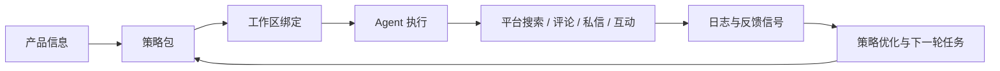

<div align="center">

# CyberNomads

> 把增长从零散的人工作业，变成 AI 可以理解、执行、迭代的策略系统。

[](./docs/CyberNomads%E7%AC%AC%E4%B8%80%E6%9C%9FMVP%E8%A7%84%E5%88%92%E8%AE%BE%E8%AE%A1%E6%96%87%E6%A1%A3.md)
[](./docs/Cybernomads%E9%A1%B9%E7%9B%AE%E6%A6%82%E5%BF%B5%E4%BB%8B%E7%BB%8D%E6%96%87%E6%A1%A3.md)
[](./docs)
[](https://github.com/Time-Machine-Lab/CyberNomads/stargazers)

<sub>For indie hackers, tiny teams, and anyone tired of doing growth by hand.</sub>

</div>

---

## 项目概览

**CyberNomads** 是一个面向独立开发者和初创团队的 AI 社交增长运营系统。它想解决的不是“怎么多发几条内容”，而是另一个更根本的问题:
如何把产品信息、增长策略、平台账号和执行动作，组织成一条可以持续推进的增长链路。

和传统自动化脚本、定时发布工具不同，CyberNomads 关注的是“策略执行”而不是“单点自动化”。它希望让 AI 不只是替你做一次动作，而是围绕既定目标，持续进行搜索、互动、评论、私信、跟进和复盘。

> 当前仓库仍处于文档驱动与 MVP 规划阶段，尚未提供正式可运行版本。README 里所有能力描述都以概念文档与 MVP 规划为准，不虚构已完成实现。

**核心特性：**

- 🛰️ 策略包驱动执行：把增长思路整理成 AI 可理解、可复用、可持续迭代的策略包。
- 🎯 面向小团队场景：聚焦新品冷启动、低预算日常运营、高意向用户私信跟进等真实使用场景。
- 🧠 Agent 化工作流：围绕产品、策略、账号和工作区组织任务，而不是把动作散落在多个工具里。
- 📡 可观测的执行台：MVP 目标是让用户能看到任务状态、执行日志和阶段性结果，而不是“黑箱自动化”。
- 🔭 为后续能力留白：归因复盘、线索雷达、品牌人格和策略实验室被明确设计为后续演进方向。

## Why CyberNomads

今天的很多独立开发者和小团队，擅长做产品，却不擅长做持续增长。真正困难的往往不是写出第一版产品，而是长期、低成本、稳定地把它带到更多人面前。

CyberNomads 想做的，是把这件高依赖经验、人力和耐心的事情，重构成一种更像“系统”的能力:
用户负责定义产品与目标，AI 负责理解策略、拆解任务、执行动作，并把反馈重新带回到下一轮迭代里。

## Growth Loop



这也是 CyberNomads 的核心美感所在: 增长不再像零碎的手工劳动，而像一条会自己呼吸的循环系统。

## 快速开始

由于仓库目前仍在概念验证与 MVP 设计阶段，下面的 Quick Start 主要帮助你在 5 分钟内理解项目，而不是直接启动生产可用程序。等首个可运行版本落地后，这一节会更新为真实安装和启动命令。

### 1. 环境要求

- [Git](https://git-scm.com/) >= 2.30
- [Node.js](https://nodejs.org/) >= 22
- Markdown 阅读工具或 GitHub 网页界面

> 当前仓库后端已经使用内置 `node:sqlite`，本地开发与测试请直接使用 Node 22。仓库根目录已提供 `.nvmrc` 和 `.node-version`。

### 2. 安装

```bash
# 克隆仓库
git clone https://github.com/Time-Machine-Lab/CyberNomads.git

# 进入项目目录
cd CyberNomads
```

### 3. 第一个示例

当前阶段的 `Hello World` 不是“跑通应用”，而是快速建立对项目的最小心智模型。你可以先从下面这份最小策略草案开始:

```markdown
# 产品名
CyberNomads

## 产品一句话介绍
一个让 AI 按策略持续执行社交增长动作的运营系统。

## 目标用户
- 独立开发者
- 初创团队产品负责人
- 增长负责人

## 初始策略
- 围绕目标产品搜索相关讨论场景
- 在合适的内容下进行评论互动
- 对高意向用户进行私信跟进
```

预期输出：你将得到一份可以继续映射到“产品信息 + 策略包 + 工作区”的最小输入草案，这也是当前 CyberNomads 文档所定义的核心起点。

如果你想直接理解项目全貌，建议先读这两份文档：

- [项目概念介绍](./docs/Cybernomads项目概念介绍文档.md)
- [第一期 MVP 规划设计](./docs/CyberNomads第一期MVP规划设计文档.md)

## 功能详情与文档

### 功能矩阵

| 功能 | 说明 | 文档 / 入口 |
|------|------|-------------|
| 项目价值主张 | 解释 CyberNomads 为什么存在、服务谁、解决什么问题 | [概念文档](./docs/Cybernomads项目概念介绍文档.md) |
| MVP 范围定义 | 明确第一期交付物、边界和成功标准 | [MVP 规划](./docs/CyberNomads第一期MVP规划设计文档.md) |
| Agent 接入中心 | MVP 中负责接入可用 Agent，并准备所需 Skill | [MVP 规划](./docs/CyberNomads第一期MVP规划设计文档.md) |
| 账号 / 产品 / 策略配置 | 管理平台账号、产品信息和 AI 可执行策略内容 | [MVP 规划](./docs/CyberNomads第一期MVP规划设计文档.md) |
| 工作区与执行台 | 绑定资产、发起任务、查看状态与日志 | [MVP 规划](./docs/CyberNomads第一期MVP规划设计文档.md) |
| 规格驱动协作 | 仓库当前采用文档与规范先行的推进方式 | [openspec](./openspec/) |

### 当前规划重点

```yaml
# 当前项目关注的 MVP 能力
agent_access: openclaw-first        # MVP 首先打通一个可用 Agent 接入入口
platform_account: bilibili-first    # MVP 首先聚焦 B 站账号登录与登记
strategy_model: markdown-based      # 产品信息与策略内容先以 Markdown 形式维护
workspace_model: product+strategy+accounts
execution_goal: observable-task-run # 重点不是“全自动”，而是“可执行且可观察”
```

| 参数 | 类型 | 当前值 | 说明 |
|------|------|--------|------|
| `agent_access` | `string` | `openclaw-first` | 第一阶段优先支持 OpenClaw 接入 |
| `platform_account` | `string` | `bilibili-first` | 第一阶段聚焦 B 站账号体系 |
| `strategy_model` | `string` | `markdown-based` | 产品与策略内容先以文本形式结构化维护 |
| `workspace_model` | `string` | `product+strategy+accounts` | 工作区是最小执行单元 |
| `execution_goal` | `string` | `observable-task-run` | 重点验证任务确实被跑起来且可观察 |

## 贡献指南

欢迎任何形式的贡献，无论你是来补文档、提想法、完善规格，还是未来参与实现。

**提交 Issue 前，请先：**

- 搜索 [现有 Issues](https://github.com/Time-Machine-Lab/CyberNomads/issues)，避免重复讨论
- 说明你是在反馈概念、补充 MVP 细节，还是提出新的产品方向
- 如果你的想法会改变范围边界，建议同步说明“为什么现在值得做”

**本地协作方式：**

```bash
# 1. Fork 并克隆仓库
git clone https://github.com/[your-username]/CyberNomads.git
cd CyberNomads

# 2. 新建分支
git checkout -b docs/your-change-name

# 3. 提交变更
git add .
git commit -m "docs(readme): refine project positioning"
```

**提交 PR 流程：**

1. 基于 `main` 创建分支，优先使用语义明确的分支名。
2. 推荐遵循 [Conventional Commits](https://www.conventionalcommits.org/)。
3. 如果变更影响产品方向、MVP 边界或关键术语，优先同步更新 `docs/` 或 `openspec/`。
4. 发起 Pull Request 时，写清楚“改了什么、为什么改、会影响什么”。

## 路线图

- [x] 项目概念文档
- [x] 第一期 MVP 规划设计
- [ ] 🔄 首个可本地启动的原型（进行中）
- [ ] OpenClaw 接入中心
- [ ] B 站账号登录与账号管理
- [ ] 产品与策略配置页
- [ ] 工作区绑定与任务执行台
- [ ] 归因复盘与反馈闭环
- [ ] 多平台与多 Agent 扩展

> 如果你想提前理解未来方向，可以从概念文档里的“线索雷达”“品牌人格”“策略实验室”几个方向继续展开。

## 许可证与致谢

当前仓库尚未补充正式 `LICENSE` 文件。在许可证发布前，请不要默认将本仓库内容视为可任意复用的开源授权资源；如果你有使用或合作需求，建议先发起 Issue 或直接联系维护者。

**致谢：**

- [TML-Docs-Spec](https://github.com/Time-Machine-Lab/TML-Docs-Spec) - README 模板与文档规范来源
- 所有正在帮助这个想法从概念走向产品的人
