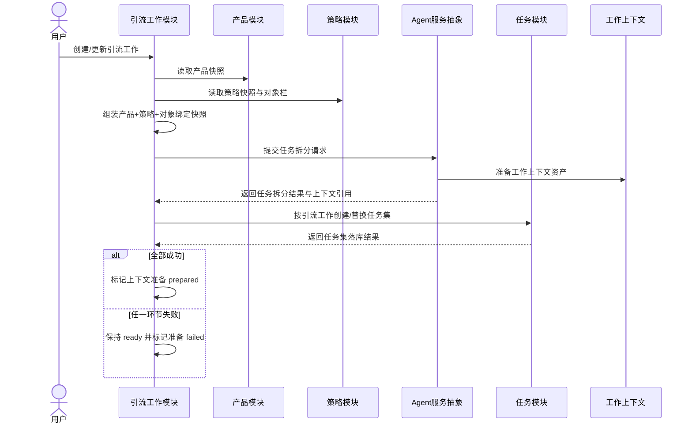

## Context

引流工作是用户可见的增长作战单元，任务是 Agent 拆分出的可执行原子工作单元。创建引流工作时，用户只提供产品、策略和对象绑定；任务本身并不是用户手写出来的，而是 Agent 结合任务拆分 Skill 和工作上下文生成。

因此本 change 负责定义一条应用层编排链路：

`TrafficWork create/update -> 构造拆分输入快照 -> Agent 服务执行任务拆分 -> 准备工作上下文 -> 任务模块批量创建/替换任务集 -> 更新引流工作准备状态`

## Goals / Non-Goals

**Goals:**
- 明确引流工作创建/更新必须触发任务拆分准备。
- 明确任务拆分输入必须是创建/更新当时的快照，而不是运行时动态读取最新产品/策略。
- 明确任务拆分结果必须通过任务模块受控入口持久化。
- 明确准备成功/失败如何影响引流工作上下文准备状态。
- 保持引流工作模块、任务模块、Agent 服务接入模块之间的边界清晰。

**Non-Goals:**
- 不实现任务调度线程。
- 不实现任务执行 Skill 本身。
- 不实现 OpenClaw 私有协议细节。
- 不定义任务产出数据本体结构。
- 不实现复杂容灾、重试、回滚或冲突合并。

## Decisions

### 1. 任务拆分是引流工作准备流程的一部分

引流工作创建后不是只准备文件夹，也不是只保存产品/策略引用；它必须触发一次 Agent 任务拆分。任务拆分完成前，该工作不能被视为可启动。

### 2. 使用快照输入，运行时消费上下文

创建/更新时，后端从产品、策略和对象绑定中构造一份拆分输入快照。Agent 基于该快照生成任务说明、任务上下文和可执行资产。后续任务执行消费的是这次准备得到的工作上下文，而不是实时读取最新产品或策略正文。

### 3. Agent 不直接改库，任务落库由受控任务模块完成

Agent 可以通过受控工具/API 提交任务拆分结果，也可以由 Agent 服务返回结构化拆分结果后让后端持久化；但无论哪种 provider 形态，数据库写入必须经过任务模块，不允许 Agent 或 subagent 直接编辑 SQLite 文件。

### 4. 更新重建复用原引流工作身份和上下文归属

引流工作更新时不创建新的 `TrafficWorkId`。系统会在原工作归属下重新触发任务拆分，并通过任务模块按工作范围替换当前任务集。替换策略属于任务模块受控行为，不通过散落文件操作隐式完成。

### 5. 准备状态以完整链路为准

只有 Agent 拆分成功、工作上下文准备成功、任务模块确认任务集已创建或替换后，才能将上下文准备状态标记为 `prepared`。任一环节失败，主状态保持或回到 `ready`，上下文准备状态标记为 `failed` 并返回失败提示。

## Flow

## Risks / Trade-offs

- [风险] Agent 拆分结果格式不稳定，导致任务落库失败。
  → 由任务拆分 Skill 输出规则、任务模块最小校验和失败反馈共同约束。
- [风险] 更新重建时替换任务集可能丢失旧任务执行历史。
  → MVP 先以“当前工作上下文可运行”为优先；历史保留策略后续可作为任务归档或执行历史能力扩展。
- [风险] 准备流程链路较长，创建接口可能等待时间变长。
  → MVP 可同步实现以降低复杂度；如耗时明显，再新增异步准备状态 change。

## Dependencies

- `define-task-contracts` 需要包含按引流工作创建/替换任务集的契约。
- `implement-task-module-runtime` 需要提供受控批量任务落库能力。
- `provide-agent-task-skills` 需要提供任务拆分 Skill。
- `agent-service-access-runtime` 需要提供 provider-neutral 的任务拆分请求入口。

