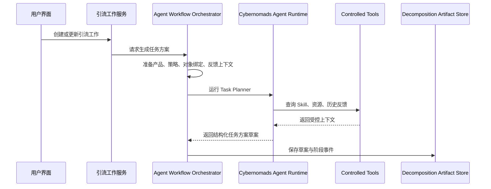
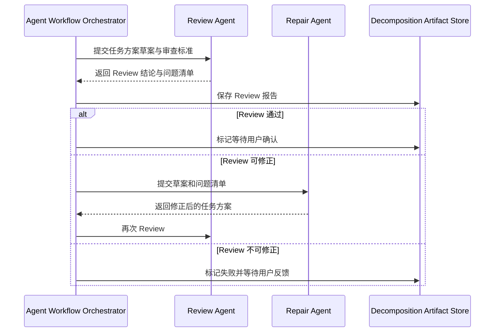
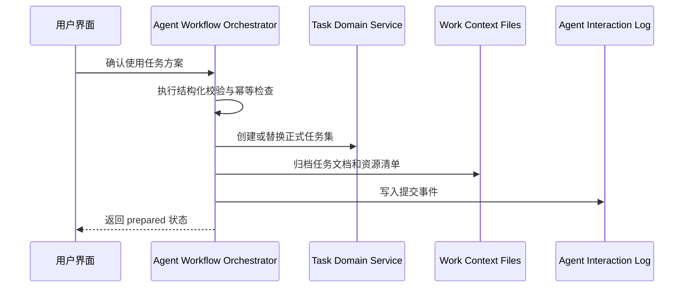

# Cybernomads Agent 架构设计

## 1. 架构引言与业务上下文 (Introduction & Context)

Cybernomads Agent 的建设目标不是再接入一个“会说话的模型”，而是把当前任务拆分链路从外部 Agent 的自由执行，升级为 Cybernomads 自己可编排、可审查、可反馈、可落库的智能体系统。

现阶段最关键的架构变化是：OpenClaw 不再承担整份引流工作的任务规划责任，只作为已确认任务的执行者；Cybernomads Agent 负责理解产品与引流策略、生成任务方案草案、调用 Agent Review 完成质量门禁，并把通过门禁的任务方案交给系统编排层落库。

本设计参考《Agentic Design Patterns: A Hands-On Guide to Building Intelligent Systems》中强调的智能体设计模式思想：智能系统应由可复用模式组合而成，例如工具使用、规划、记忆、多智能体协作、自我修正与安全护栏。Cybernomads Agent 不追求一次性做成通用 Agent 平台，而是围绕“把产品 + 引流策略转成可执行任务链路”这个业务目标，裁剪出一套轻量、可演化的 Agent Runtime。

### 1.1 系统上下文 (System Context)

Cybernomads Agent 位于业务后端与模型供应商之间，同时连接本地 Skill 资产、受控 Tools、任务草案存储、Review 结果、用户反馈和 OpenClaw 执行链路。

默认技术选择为 **OpenAI Agents SDK TypeScript + Cybernomads 自有编排层**：

- OpenAI Agents SDK TypeScript 负责业内常规 Agent 能力，包括 Agent、Tools、Handoffs、Guardrails、Tracing 与 Responses API 调用。
- Cybernomads 后端负责业务阶段机、持久化、用户确认、反馈重拆、任务落库和 OpenClaw 执行边界。
- 模型供应商通过 OpenAI-compatible provider 配置接入，默认使用 `CONTENT_FOREST_CODEX_RESEARCH_*` 这一组环境变量；密钥只允许在运行环境注入，不进入仓库文档、代码或日志。


系统上下文中的关键参与方如下：

- **本地用户**：创建引流工作、查看拆分进度、阅读拆分报告、确认任务方案或反馈重拆。
- **Cybernomads 后端**：承接业务编排、阶段推进、草案保存、Review 结果保存、确认后落库、执行调度与观察。
- **Cybernomads Agent Runtime**：运行任务拆分 Agent、Review Agent、修正 Agent 与报告 Agent，提供常规 Agent 能力。
- **Skill Registry**：管理 Cybernomads 自有 Skill、平台 Skill 与知识说明，作为 Agent 的能力说明层。
- **Controlled Tool Registry**：提供受控工具，允许 Agent 查询上下文、选择资源、生成草案、执行检查，但禁止绕过系统边界直接写库。
- **GPT Provider**：默认使用 OpenAI-compatible Responses API，模型默认为 `gpt-5.5`，可按 provider adapter 替换。
- **OpenClaw Executor**：只执行已经由 Cybernomads 确认的单个任务，不再负责整份任务拆分。

### 1.2 场景视图 (+1 View / Scenarios)

本架构优先保证四个核心场景跑通。

**场景一：生成任务方案草案**

用户创建或更新引流工作后，系统收集产品正文、策略正文、对象绑定、历史反馈和可用资源。Cybernomads Agent 基于这些信息生成一份结构化任务方案草案。此时任务方案只进入草案存储，不直接写入正式任务表。

**场景二：Agent Review 质量门禁**

任务方案草案生成后，Review Agent 从任务粒度、明确产出、策略目标覆盖、输入输出关系、工具材料准备和可运行性等维度进行审查。Review 不通过时，系统进入修正循环；Review 通过时，任务方案进入等待用户确认状态。

**场景三：用户确认后系统编排落库**

用户确认方案后，系统编排层负责最终落库、资源复制、任务文档归档和状态更新。Agent 可以提供结构化方案和 Review 结论，但不拥有最终数据库写入权。

**场景四：执行异常反馈后重拆**

OpenClaw 执行单任务失败或用户发现方案问题时，用户可以把问题反馈到对应拆分报告。下一轮 Cybernomads Agent 会带着原方案、Review 问题、执行异常和用户反馈重新生成任务方案，而不是从零重新抽取。

## 2. 逻辑视图：系统结构与模块边界 (Logical View)

Cybernomads Agent 采用“轻量 Agent Runtime + 后端业务编排”的结构。Agent Runtime 负责智能判断，后端编排层负责流程、状态和不可逆动作。


### 2.1 Agent Workflow Orchestrator

Agent Workflow Orchestrator 是 Cybernomads 后端中的业务编排模块，负责控制任务拆分生命周期。它不直接做任务质量判断，但负责决定什么时候调用哪个 Agent、什么时候等待 Review、什么时候让用户确认、什么时候执行系统落库。

它的核心职责包括：

- 创建任务拆分运行批次，并记录本次拆分与引流工作的关系。
- 组织上下文，包括产品、策略、对象绑定、历史反馈、运行异常和可用资源。
- 调用 Cybernomads Agent Runtime 执行 Planner、Reviewer、Repairer、Reporter 等角色。
- 保存任务方案草案、Review 报告、修正记录和用户反馈。
- 在用户确认后调用任务域服务完成正式任务写入。
- 将阶段变化写入现有 Agent Interaction Log，供前端进度面板和诊断使用。

### 2.2 Cybernomads Agent Runtime

Agent Runtime 是具体智能体执行层，建议第一版使用 **OpenAI Agents SDK TypeScript**。选择它的原因不是“功能最多”，而是它足够轻，并且与当前 Node.js TypeScript 后端天然贴合。

Agent Runtime 应具备以下常规 Agent 能力：

- **Agent**：封装角色、指令、模型、工具和输出结构。
- **Tools**：把后端受控函数暴露为 Agent 可调用工具，并使用 schema 校验输入输出。
- **Handoffs**：让 Planner 将结果交给 Reviewer，或让 Reviewer 将修正意见交给 Repairer。
- **Guardrails**：用于输入输出结构校验、敏感信息阻断、工具调用边界保护；质量判断本身仍交给 Review Agent。
- **Tracing**：记录模型调用、工具调用、handoff 和 guardrail 结果，补充现有 Agent Interaction Log。
- **Structured Output**：要求任务方案、Review 结论和报告摘要以可检查结构返回。

这层不直接处理业务状态机，也不直接操作数据库。它输出的是“可审查的智能判断结果”。

### 2.3 Agent 角色划分

第一版建议采用少量专用 Agent，而不是堆很多 Agent。过多 Agent 会增加延迟和不可控性，反而让拆分质量变差。

建议保留四类角色：

- **Context Analyst**：理解产品、策略、对象绑定、历史反馈和可用资源，输出本次拆分关注点。
- **Task Planner**：生成结构化任务方案草案，包括任务目标、输入、输出、依赖、资源需求和执行建议。
- **Review Agent**：作为后端门禁，判断任务是否过大、过小、重复、缺少产出、依赖不合理、材料不充分或未覆盖策略目标。
- **Repair Agent**：当 Review 发现可修复问题时，根据 Review 问题清单修正任务方案。
- **Report Agent**：把最终方案、Review 结论和修正过程整理成用户可读的拆分报告。

其中 Context Analyst 可以在第一版合并到 Task Planner 中，Report Agent 也可以由后端根据结构化结果生成。第一版最不能省的是 **Task Planner + Review Agent + Repair Loop**。

### 2.4 Skill Registry

Skill Registry 是 Cybernomads Agent 的能力说明层。它负责告诉 Agent 当前有哪些可用 Skill、每个 Skill 适合什么任务、输入输出约束是什么、运行时资源位于哪里。

设计上沿用当前 `runtime-assets/agent/skills` 与运行时 `cybernomads/agent/skills` 的思路，但职责需要从“给 OpenClaw 读的文件”升级为“Cybernomads Agent 可发现、可选择、可引用的能力注册表”。

Skill 需要具备以下管理语义：

- **全局 Skill**：随系统交付，适合多个引流工作复用。
- **工作级 Skill**：复制到单个引流工作上下文，只服务当前任务方案。
- **Skill 版本**：拆分报告中需要记录本次任务方案使用了哪些 Skill 及其版本或路径。
- **Skill 适配说明**：Agent 不只看到 Skill 名称，还要知道适用场景、禁区、依赖材料和输出要求。

### 2.5 Controlled Tool Registry

Tool Registry 是 Cybernomads Agent 能力落地的关键。这里的核心原则是：**Agent 可以调用工具，但工具必须受控；Agent 可以生成方案，但不可绕过系统编排执行不可逆写入。**

工具分三层：

- **只读工具**：读取引流工作上下文、列出可用 Skill、列出可用知识、读取历史反馈、读取执行异常摘要。
- **草案工具**：保存任务方案草案、保存 Review 结论、保存拆分报告、执行结构化校验、生成资源清单。
- **系统提交工具**：正式任务落库、替换任务集、资源最终归档、状态改为 prepared。这一层默认只允许 Orchestrator 调用，不直接暴露给 Agent 自由调用。

这能同时满足两个要求：一方面 Agent 是行业常规 Agent，具备 Tools 能力；另一方面数据库、迁移和执行仍由 Cybernomads 系统编排。

### 2.6 Decomposition Artifact Store

任务拆分过程需要从“瞬时消息”升级为“可回放的方案资产”。因此需要新增任务拆分产物存储，用来记录每次拆分运行批次中的核心结果。

该存储负责承载：

- 任务方案草案
- Review 报告
- 修正历史
- 用户反馈
- 资源清单
- 拆分报告
- 最终确认快照

这些产物既服务前端进度与报告展示，也服务下一次反馈重拆。

### 2.7 OpenClaw 执行边界

OpenClaw 保留为执行 Agent provider，但职责从“任务规划 + 任务落库 + 执行”收敛为“单任务执行”。它接收的输入应来自已经确认的 Cybernomads 任务方案。

OpenClaw 不再负责：

- 理解整份产品和策略后自由拆分任务。
- 自行决定任务是否写入数据库。
- 自行决定整份引流工作是否 prepared。
- 在执行阶段重规划整份任务链路。

OpenClaw 继续负责：

- 执行单个已确认任务。
- 使用任务文档、Skill、Tools 和上下文材料。
- 回写单任务状态、产出和异常。

## 3. 过程视图：运行时与数据流 (Process View)

### 3.1 任务拆分生命周期

任务拆分不再是“一次 Agent 消息提交”，而是一个可观察、可重试、可确认的生命周期。


推荐阶段如下：

1. **context_ready**：后端完成产品、策略、对象绑定、历史反馈和资源索引的准备。
2. **planning**：Task Planner 生成任务方案草案。
3. **reviewing**：Review Agent 检查任务质量和可运行性。
4. **repairing**：Repair Agent 根据 Review 问题修正方案，必要时可循环 1-2 次。
5. **waiting_user_confirmation**：Review 通过后，等待用户确认或反馈重拆。
6. **committing**：用户确认后，系统编排层执行任务落库、任务文档归档和资源提交。
7. **prepared**：任务方案正式可运行。
8. **failed**：模型失败、Review 不可修复、工具失败或用户取消。

### 3.2 生成任务方案草案的数据流



这一过程中的关键点是：Agent 输出草案，系统保存草案；草案还不是正式任务集。

### 3.3 Review 与修正数据流



Review Agent 的判断维度包括：

- 任务是否过大，导致执行 Agent 无法独立完成。
- 任务是否过小，导致任务链路碎片化且没有业务产出。
- 任务是否重复，多个任务是否在做同一件事。
- 每个任务是否有明确产出，以及产出能否被人或下游任务消费。
- 任务是否覆盖策略目标，而不是偏离增长目的。
- 下游任务输入是否有来源说明。来源可以是上游任务产出，也可以是外部材料、平台数据、用户提供资源或运行时工具结果，但必须声明来源类型。
- 任务依赖和协作关系是否合理。
- 所需 Skill、Tools、Knowledge、Data 是否已经声明，且是否能被执行阶段访问。

### 3.4 用户确认与系统提交数据流



正式提交阶段由系统执行，原因有三个：

- 任务落库需要事务性和幂等性。
- 资源归档需要路径边界与权限控制。
- 用户确认是产品语义，不应该由 Agent 自行推断。

### 3.5 执行与反馈回流

任务正式 prepared 后，现有调度器继续扫描可执行任务。OpenClaw 接收单任务上下文并执行。若执行异常，异常不会只停留在执行日志，而会变成下一次任务拆分的反馈材料。

反馈回流包含三类来源：

- 用户主动反馈：任务太粗、任务太碎、依赖错误、缺少工具、产出不清、策略理解错误。
- Review 历史问题：上次 Review 中曾发现但已修复的问题。
- 执行异常：OpenClaw 执行失败、工具不可用、材料缺失、平台响应异常、产出无法被下游消费。

## 4. 物理视图：基础设施与部署 (Physical View)

Cybernomads 当前仍建议保持本地 Node.js TypeScript 模块化单体，不为 Agent 单独拆微服务。Agent Runtime 作为后端内部模块运行，复用现有 SQLite、本地文件系统、Agent Interaction Log 和运行时资产目录。

推荐物理结构如下：

```text
cybernomads-backend/
├── src/
│   ├── modules/
│   │   ├── agent-access/                 # 现有 Agent provider 接入
│   │   ├── traffic-works/                # 引流工作生命周期
│   │   ├── tasks/                        # 正式任务域
│   │   └── task-decomposition-runs/      # 新增：拆分运行批次与产物
│   ├── adapters/
│   │   ├── agent/
│   │   │   ├── openclaw/                 # OpenClaw 执行 provider
│   │   │   └── cybernomads-agent/        # 新增：Cybernomads Agent Runtime
│   │   └── storage/
│   └── ports/
│       ├── agent-provider-port.ts
│       ├── cybernomads-agent-runtime-port.ts
│       └── task-decomposition-artifact-store-port.ts
└── runtime-assets/
    └── agent/
        ├── skills/
        └── knowledge/
```

运行时工作目录建议补充拆分批次目录：

```text
cybernomads/
├── agent/
│   ├── skills/
│   └── knowledge/
└── work/
    └── <trafficWorkId>/
        ├── skills/
        ├── tools/
        ├── knowledge/
        ├── data/
        ├── decomposition-runs/
        │   └── <runId>/
        │       ├── task-plan-draft.json
        │       ├── review-report.json
        │       ├── decomposition-report.md
        │       ├── resource-manifest.json
        │       └── feedback.md
        └── <taskKey>.md
```

### 4.1 模型与供应商配置

第一版默认接入 GPT 供应商，配置来自环境变量：

- `CONTENT_FOREST_CODEX_RESEARCH_BASE_URL`
- `CONTENT_FOREST_CODEX_RESEARCH_API_KEY`
- `CONTENT_FOREST_CODEX_RESEARCH_WIRE_API`
- `CONTENT_FOREST_CODEX_RESEARCH_MODEL`
- `CONTENT_FOREST_CODEX_RESEARCH_REASONING_EFFORT`
- `CONTENT_FOREST_CODEX_RESEARCH_AUTH_METHOD`
- `CONTENT_FOREST_CODEX_RESEARCH_WEB_SEARCH_ENABLED`
- `CONTENT_FOREST_CODEX_RESEARCH_SEARCH_CONTEXT_SIZE`
- `CONTENT_FOREST_CODEX_RESEARCH_TIMEOUT_MS`
- `CONTENT_FOREST_CODEX_RESEARCH_MAX_OUTPUT_TOKENS`

其中 API Key 只允许作为 secret 在进程环境中读取。文档、日志、草案、Review 报告和任务文档中都不应输出密钥原文。Tool guardrail 需要阻断包含密钥样式文本的工具输入和工具输出。

### 4.2 推荐依赖边界

第一版建议新增依赖保持克制：

- `@openai/agents`：Agent Runtime、Tools、Handoffs、Guardrails、Tracing。
- `openai`：自定义 baseURL 与 apiKey 客户端。
- `zod`：工具参数和结构化输出 schema。

暂不把 LangGraph 作为默认主框架。LangGraph 的 durable execution、人类审批中断和图状态能力很强，但会引入一套新的工作流运行时。当前 Cybernomads 已经有自己的业务阶段、SQLite、文件产物和用户确认流程，第一版更适合用后端显式阶段机承接持久化。若未来拆分流程演化为复杂分支、并行多 Agent、长时间暂停恢复，再评估引入 LangGraph。

## 5. 关键架构决策与权衡 (Design Decisions & Trade-offs)

**决策：第一版使用 OpenAI Agents SDK TypeScript 作为轻量 Agent 框架**

- **背景**：Cybernomads 后端当前是 Node.js TypeScript，本期目标是快速建设自有 Agent，而不是搭建通用 Agent 平台。
- **决策**：使用 OpenAI Agents SDK TypeScript 作为 Agent Runtime，Cybernomads 后端自己维护业务阶段机和持久化。
- **理由**：它提供 Agent、Tools、Handoffs、Guardrails、Tracing 和 Responses API 支持，抽象足够少，能贴合现有代码结构。
- **后果**：需要自己设计拆分运行批次、草案存储和用户确认流程；但这部分本来就是 Cybernomads 的业务核心，不应该完全交给框架。

**决策：Agent Review 负责质量门禁，代码只负责结构、安全和流程边界**

- **背景**：用户明确不希望用硬编码逻辑判断任务质量，希望交给 Agent Review 判断。
- **决策**：任务过大、过小、重复、产出不清、依赖不合理、目标覆盖不足等质量判断由 Review Agent 完成；代码只做 schema 校验、权限控制、幂等控制和危险动作拦截。
- **理由**：任务质量是上下文判断，不适合用少量静态规则替代；但安全边界和数据一致性必须由代码保证。
- **后果**：Review 结论不是数学确定性的，需要保存 Review 理由、问题清单和修正历史，方便用户理解和后续迭代。

**决策：Agent 只生成可检查方案，系统负责任务落库、迁移和执行编排**

- **背景**：当前链路中 Agent 自由保存任务会导致 meta 数据、落库规则和构建方式不可控。
- **决策**：Agent 输出结构化任务方案草案和 Review 结论；用户确认后，由 Orchestrator 调用任务域服务完成正式写入。
- **理由**：数据库写入、任务替换、资源归档和状态更新是系统职责，需要事务性、幂等性和可审计性。
- **后果**：拆分流程会多一个确认和提交阶段，但可控性、可回滚性和用户信任会明显提升。

**决策：Tools 分层开放，不把所有工具都交给 Agent 自由调用**

- **背景**：Cybernomads Agent 需要 Tools 能力，但工具一旦包含文件写入、数据库写入或资源复制，就可能产生不可逆副作用。
- **决策**：只读工具和草案工具可给 Agent 调用；正式提交工具默认只给 Orchestrator 调用。
- **理由**：这样既保留常规 Agent 的工具使用能力，又避免 Agent 绕过系统边界。
- **后果**：Tool Registry 需要表达工具风险等级和调用主体，短期设计更复杂，但长期更稳。

**决策：Skill 从执行说明升级为能力注册资产**

- **背景**：当前任务拆分 Skill 已经承担大量规则，但更像给外部 Agent 读取的一组说明。
- **决策**：把 Skill 纳入 Cybernomads Agent Runtime 的能力注册体系，支持发现、选择、引用、复制和版本记录。
- **理由**：任务拆分质量不仅取决于任务本身，也取决于是否为任务准备了正确的工具和材料。
- **后果**：需要补充 Skill metadata 与资源清单，但拆分报告可以清楚说明每个任务为什么具备执行条件。

**决策：OpenClaw 降级为执行者，不再承担任务规划质量责任**

- **背景**：OpenClaw 适合执行任务，但不应该决定 Cybernomads 的任务结构质量。
- **决策**：OpenClaw 只接收已确认的单任务执行请求；任务拆分、Review、重拆和确认由 Cybernomads Agent 与后端编排负责。
- **理由**：职责边界清晰后，任务规划质量可以由 Cybernomads 自己演化，OpenClaw provider 替换也不会影响拆分内核。
- **后果**：现有 OpenClaw `submitMessage` 异步拆分链路需要逐步迁移到 Cybernomads Agent 的同步或半同步结构化输出链路。

**决策：任务输入来源允许来自上游，也允许来自外部，但必须显式声明来源类型**

- **背景**：并非所有下游输入都来自上游任务，可能来自用户素材、平台数据、历史数据、知识文件或工具实时结果。
- **决策**：Review Agent 不强制要求输入都来自上游产出，而是要求每个输入都有来源声明、可获取方式和缺失时处理方式。
- **理由**：这比“全部输入必须来自上游”更符合真实任务运行，同时仍能检查可运行性。
- **后果**：任务方案结构需要表达输入来源类型和可用性说明，Review 报告也要指出不可信输入。

**决策：反馈重拆基于历史产物，而不是重新开始一次空白拆分**

- **背景**：用户反馈“任务拆分后运行不正常，重新拆分不方便”，本质是缺少可复用的失败经验。
- **决策**：每次重拆都读取上一轮任务方案、Review 结论、用户反馈和执行异常。
- **理由**：这让 Agent 修正具体错误，而不是再次随机生成一组看似合理的任务。
- **后果**：需要新增拆分产物存储和反馈入口，但这是提升拆分质量的核心闭环。

**决策：保留 LangGraph 作为后续可选升级，而不是第一版默认引入**

- **背景**：LangGraph 擅长长运行、有检查点、人类审批和复杂多分支 Agent 工作流。
- **决策**：当前不默认引入 LangGraph；当 Cybernomads Agent 出现并行评审、多轮人类编辑、跨天恢复和复杂分支时再评估。
- **理由**：第一版的流程节点明确，后端阶段机足够承载；过早引入图工作流会增加学习和调试成本。
- **后果**：我们需要自己维护阶段状态，但换来更简单的落地路径和更低框架耦合。

## 6. 需要特别注意的问题

1. **不要泄露模型供应商密钥**：用户提供的 API Key 只能作为本地运行环境 secret 注入，不进入文档、代码、日志、草案或报告。
2. **Review Agent 不是万能裁判**：Review 要给出理由和问题清单，不能只给“通过/失败”。
3. **结构化输出必须强制**：Planner、Reviewer、Repairer 的输出都必须有 schema，否则后端无法可靠编排。
4. **工具调用必须有风险等级**：只读、草案、提交三类工具必须区分调用主体。
5. **不要让 Agent 拥有最终落库权**：任务表、迁移、状态更新由系统编排层负责。
6. **OpenClaw 输出获取问题要绕开**：规划阶段不再依赖 OpenClaw 返回消息；执行阶段仍通过现有 `sendMessage` / history / interaction log 记录执行结果。
7. **第一版不要过度多 Agent 化**：Planner + Reviewer + Repair Loop 足够，过多角色会降低可控性。
8. **供应商可替换但接口要收敛**：默认 GPT provider，但 Cybernomads Agent Runtime 应通过 provider adapter 接入，避免把业务逻辑写死到某个模型供应商。

## 7. 实施边界补充（2026-05-20）

本期实现采用后端内置的 Cybernomads Agent Runtime，并把框架能力控制在最小可落地范围：

- provider code 固定为 `cybernomads-agent`，只作为 `planning` provider。
- GPT / OpenAI-compatible Responses API 通过服务地址、模型、推理强度和 API Key 配置；API Key 只进入 secret store。
- Runtime 输出必须通过 schema 校验后才能保存为任务方案草案、Review 报告、修正历史和报告产物。
- Controlled Tool Registry 只向 Agent 暴露只读工具和草案工具说明；正式任务提交、资源最终归档和 prepared 状态更新只允许 Orchestrator 调用。
- Agent Interaction Logs 记录 provider code、模型、阶段、工具名和结构化摘要，并全链路脱敏 API Key、Authorization、Bearer token 与 credential-like values。

第一版报告可由后端基于结构化草案和 Review 报告渲染，不强制单独调用 Report Agent。这样可以先保证确认前不落库、确认后系统提交和反馈重拆三条业务边界稳定。


## Addendum: Center-View Ownership Boundary (2026-05-20)

Cybernomads Agent owns generation of structured task plan drafts, Review reports, repair attempts, and decomposition reports. These artifacts remain internal planning artifacts until the user confirms a plan.

The backend owns the task decomposition center projection. It reads the latest decomposition run and its artifacts, filters them into a safe display contract, derives progress and available actions, and excludes provider secrets, raw prompts, Authorization headers, and unfiltered artifact internals.

OpenClaw remains the execution provider for confirmed formal tasks. It does not own draft review, center-view projection, or formal task persistence.
