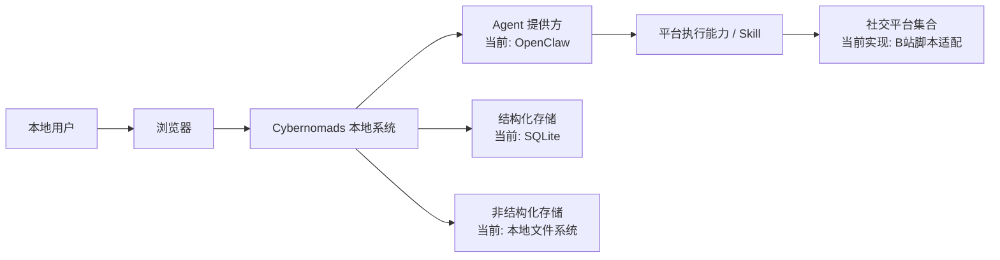
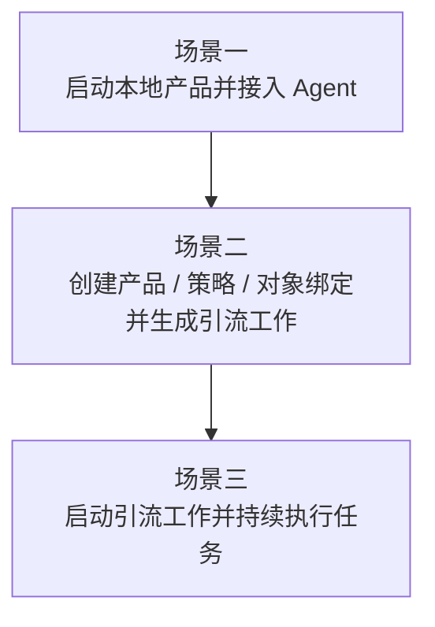
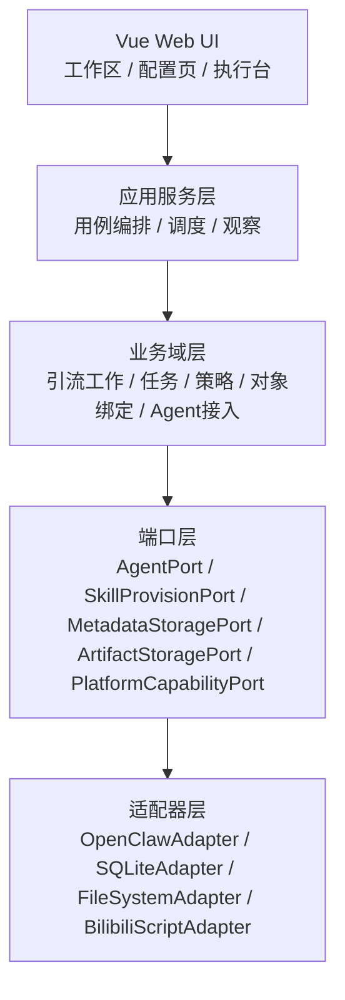
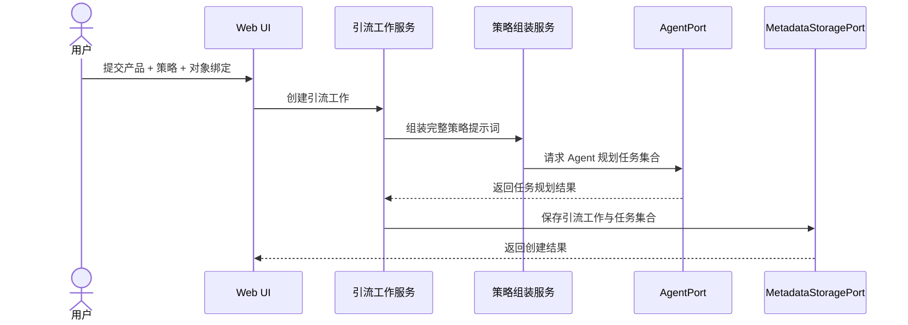
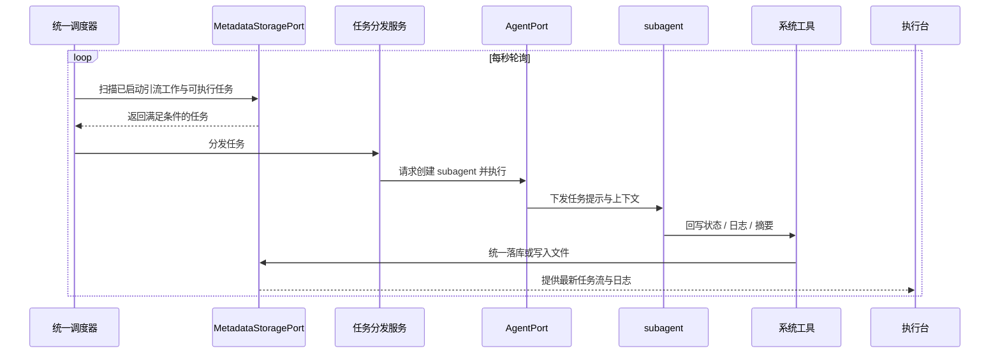
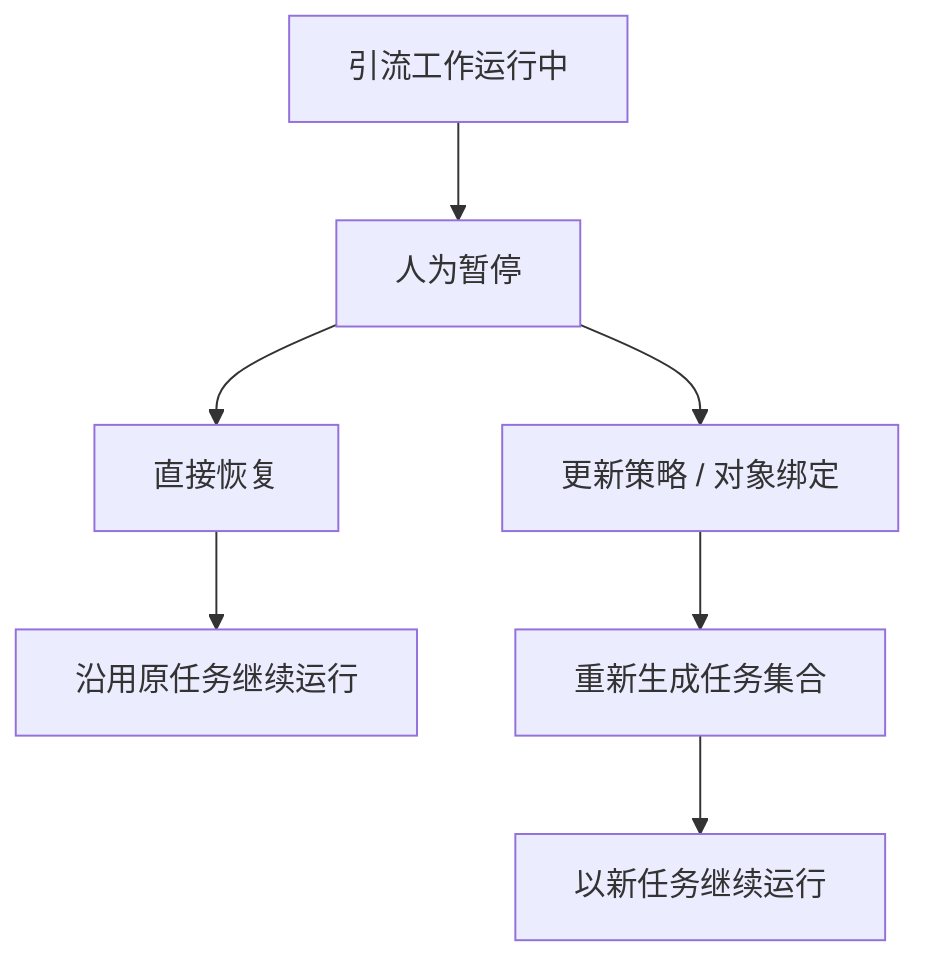
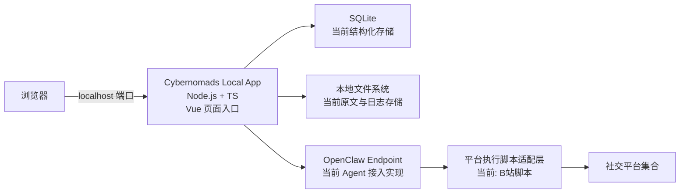

# Cybernomads 架构设计文档

## 1. 架构引言与业务上下文 (Introduction & Context)

Cybernomads 的第一期产品形态是一个本地运行、单机单用户使用的软件。用户通过命令启动本地服务后，在浏览器中访问本地端口完成 Agent 接入、平台账号管理、产品与策略配置、引流工作创建与执行观察。当前阶段的架构目标不是追求复杂分布式能力，而是在保证 MVP 可落地的前提下，为后续多平台、多 Agent 和多种存储介质切换预留稳定边界。

本架构重点解决三件事：
- 提供一个本地前后端一体化产品入口，而不是零散脚本或独立 Skill 集合。
- 把“产品 + 策略 + 对象绑定”转化为可长期驻留的引流工作，并通过调度器和 Agent 执行持续运行。
- 让存储层和 Agent 层都只需要替换实现，而不影响上层业务模型和交互流程。

### 1.1 系统上下文 (System Context)

Cybernomads 位于本地用户工作环境与外部 Agent / 平台生态之间。它负责承接配置、调度、状态管理和日志观察，但不直接把平台脚本能力、Agent 实现或存储介质写死在系统核心中。

当前上下文中的关键参与方如下：
- **本地用户**：通过浏览器访问 Cybernomads 页面，完成配置、创建引流工作、启动和观察执行。
- **Cybernomads 系统**：负责前端展示、业务编排、任务调度、状态存储、日志管理和 Agent / 平台适配。
- **Agent 提供方**：当前接入 OpenClaw，未来可切换为远端 Agent 或本地 Agent。
- **平台执行能力**：由 Agent 借助 Skill 或适配能力调用平台交互脚本。架构上支持多平台，当前仅实现 B 站脚本适配。
- **结构化存储**：当前默认使用 SQLite 承载元数据和状态索引，未来可切换为 MySQL、Redis 或其他介质。
- **非结构化存储**：当前默认使用本地文件系统承载 Markdown 原文、日志原文和执行产物引用，未来可切换为对象存储或远端文件服务。

### 1.2 场景视图 (+1 View / Scenarios)

本架构优先服务以下三个核心场景。如果这三条链路跑不通，则该架构无效。

**场景一：用户完成本地启动与 Agent 接入**
- 用户启动本地服务并访问页面。
- 用户选择当前可用的 Agent 接入方式并完成连接。
- 系统检查并准备运行 Cybernomads 所需的能力包。

**场景二：用户基于产品、策略和对象绑定创建引流工作**
- 用户维护产品内容、策略包与策略。
- 用户在策略中声明所需对象，并在创建引流工作时绑定具体资源。
- 系统生成引流工作，并基于完整策略提示词规划任务集合。

**场景三：引流工作启动后持续执行任务并产生日志**
- 用户启动某个引流工作。
- 系统调度器持续判断哪些任务满足执行条件。
- Agent 创建 subagent 执行任务，并通过系统工具回写状态和日志。
- 前端执行台持续展示任务流和日志时间线。

## 2. 逻辑视图：系统结构 (Logical View)

Cybernomads 采用“本地运行的模块化单体”结构。前端和后端以一个产品交付，但后端内部通过明确的业务模块和端口边界隔离变化点，尤其是存储层与 Agent 层。

### 2.1 展现层：Vue Web UI
展现层负责承接用户的所有可见操作，主要包括：
- 工作区与引流工作入口
- Agent 接入与能力准备入口
- 平台账号、产品、策略包、策略和对象绑定管理入口
- 执行观察入口，包括任务流可视化、状态面板和日志时间线

该层只负责“用户看见什么、如何触发操作”，不直接拥有任务调度逻辑，也不直接依赖具体存储或 Agent 实现。

### 2.2 应用服务层：业务编排与用例承接
应用服务层是系统的用例编排中心，负责把用户操作转成业务流程，主要包含：
- 引流工作管理服务：创建、启动、暂停、恢复、更新、结束
- 策略组装与任务生成服务：把策略包组合后的完整提示词交给 Agent，生成任务集合
- 任务调度服务：负责当前 MVP 的线程决策
- 任务分发服务：把可执行任务交给 Agent 适配层
- 日志与观察服务：统一汇总状态、日志和执行摘要供前端查询

### 2.3 业务域层：核心业务边界
业务域层承载稳定的业务概念，而不在这里展开高变动的字段级细节。当前建议固定以下边界：

- **Agent 接入域**
  负责 Agent 接入方式、连接状态和能力准备状态。

- **资源与对象绑定域**
  负责账号、图片、素材等可被策略引用的资源，以及策略到具体资源的绑定关系。

- **产品域**
  负责产品内容及其版本化管理，不直接参与任务调度。

- **策略包与策略域**
  负责策略包复用、策略组合、完整提示词编译和对象引用解析。

- **引流工作域**
  负责引流工作的生命周期管理，以及“暂停恢复”和“暂停更新后重建”两条路径的语义区分。

- **任务域**
  负责任务集合的存在方式、执行状态流转和对调度器可见的执行条件，但不在顶层架构文档中声明具体字段。

### 2.4 端口层：可替换能力边界

为了保证存储层和 Agent 层只替换实现即可，系统需要明确以下端口：

- **AgentPort**
  负责连接 Agent、请求任务规划、创建主 Agent / subagent 和发起执行请求。当前由 OpenClawAdapter 实现。

- **SkillProvisionPort**
  负责检查、安装、更新 Cybernomads 运行所需的能力包。

- **PlatformCapabilityPort**
  负责承接平台脚本能力。架构上支持多平台，当前只提供 B 站脚本适配实现。

- **MetadataStoragePort**
  负责保存结构化元数据、状态、关系和查询索引。

- **ArtifactStoragePort**
  负责保存 Markdown 原文、日志原文和执行产物引用等非结构化内容。

### 2.5 当前推荐的存储职责划分

为了兼顾 MVP 简洁性与后续演进，当前阶段推荐如下职责分工：
- **SQLite**：承载结构化状态、关系和查询入口
- **本地文件系统**：承载体积更大或格式更自由的原文内容和日志内容

这是一种职责解耦，而不是技术绑定。上层业务只依赖存储端口，不依赖 SQLite 或文件系统本身。

## 3. 过程视图：运行时与数据流 (Process View)

Cybernomads 的运行时核心，是“引流工作”长期驻留后的持续调度与状态回写。当前 MVP 明确区分两类执行规划能力：
- **线程决策**：当前实现。由系统调度器按任务条件判断是否该执行。
- **Agent 决策**：未来扩展。由主 Agent 负责整体任务节奏、自主规划和动态调度。

本期架构只实现线程决策，但在架构边界中保留 Agent 决策的扩展位置。

### 3.1 过程一：创建引流工作并生成任务

当用户完成产品、策略和对象绑定后，系统会先把策略包组合为一段完整提示词，再交由 Agent 对该提示词进行理解与任务拆分，最终生成该引流工作下的任务集合。

这一过程中的关键点是：
- 策略包先组合为完整提示词，再交给 Agent。
- 任务在引流工作创建或更新时一次性生成，而不是运行时临时生成。
- 多账号和其他资源通过对象绑定注入任务上下文，而不是写死在调度层。

### 3.2 过程二：引流工作启动后的任务调度与执行

引流工作启动后将长期驻留，系统使用统一调度器持续扫描所有已启动引流工作，而不是“每个引流工作一个独立线程”。调度器只负责判断“该不该执行”，不负责理解任务内容。

这一过程中的关键点是：
- 当前阶段只实现线程决策，不实现任务失败重试和手动恢复。
- subagent 不直接修改数据库，而是只能调用系统工具回写状态和日志。
- 平台交互通过平台能力适配层完成，当前只实现 B 站脚本适配，但过程结构本身不依赖 B 站。

### 3.3 过程三：暂停、恢复与更新

引流工作在运行时支持人为暂停。暂停后的语义分成两条路径：
- **恢复**：继续基于原有任务运行，不重新生成任务。
- **更新**：在暂停状态下允许用户更新策略或对象绑定，再由 Agent 基于新策略重新生成任务集合。

这个区分很重要，因为它把“继续执行原计划”和“基于新策略重新规划”明确拆开，避免恢复和重建混为一谈。

## 4. 物理视图：基础设施与部署 (Physical View)

当前阶段的 Cybernomads 采用极简本地部署形态。用户通过命令启动本地 Node.js 服务后，在浏览器中访问本地端口完成全部操作。前端 Vue 页面和后端业务服务以一个本地产品交付，外部只依赖 Agent 连接和平台访问。

从部署角度看，有三条关键约束：
- **单机本地、单用户**
- **前后端本地统一入口**
- **外部依赖最小化，当前只落一个 Agent 接入实现和一个平台脚本实现**

## 5. 关键架构决策与权衡 (Design Decisions & Trade-offs)

**决策：采用模块化单体，而不是一开始拆分微服务**
- **背景**：当前产品是本地运行、单机单用户、MVP 阶段，核心目标是快速形成完整闭环。
- **决策**：采用一个本地 Node.js 应用承载前后端与业务编排，通过模块边界和端口抽象管理复杂度。
- **理由**：实现更轻，启动更简单，更符合 OpenClaw 式本地产品体验。
- **后果**：后续若扩展到远端服务化，需要进一步演化部署形态，但当前不会承担微服务带来的额外复杂度。

**决策：存储层按端口抽象，并拆分结构化与非结构化职责**
- **背景**：当前使用 SQLite 与本地文件系统，但后续可能切换为 MySQL、Redis 或其他存储介质。
- **决策**：业务层只依赖 `MetadataStoragePort` 与 `ArtifactStoragePort`，由当前适配器分别落到 SQLite 与文件系统。
- **理由**：保证未来切换存储介质时只变更实现层，而不是重写业务逻辑。
- **后果**：当前实现需要多一层抽象，短期编码量略有增加，但换来后续迁移成本显著降低。

**决策：Agent 层通过端口解耦，subagent 不直接操作数据库**
- **背景**：当前接入 OpenClaw，未来可能切换到远端 Agent 或本地 Agent；同时任务执行中需要频繁更新状态和日志。
- **决策**：Agent 只通过统一端口接入，subagent 只能调用系统工具更新状态和日志，而不能直接访问数据库。
- **理由**：这样 Agent 层与存储层都保持独立，后续无论更换 Agent 还是更换存储介质，都不会破坏核心业务模型。
- **后果**：需要设计一层明确的工具接口，但换来更可控的状态流转和更低的耦合风险。

**决策：平台能力按多平台抽象设计，当前只实现 B 站执行适配**
- **背景**：产品目标是支持多平台，但 MVP 只适合优先落一个平台脚本能力。
- **决策**：架构上引入 `PlatformCapabilityPort` 承接平台能力，当前仅提供 B 站执行适配实现。
- **理由**：既避免一开始多平台铺开导致实现失控，也不会把平台能力写死在系统核心中。
- **后果**：当前平台体验仍然是单实现，但后续扩展到其他平台时不必重构上层业务模型。

**决策：任务在引流工作创建或更新时生成，运行时只做线程决策**
- **背景**：引流工作需要长期驻留执行，但 MVP 不适合一开始实现复杂的自主调度系统。
- **决策**：任务在引流工作创建或更新时由 Agent 一次性生成；运行时由调度器基于执行条件判断是否执行。
- **理由**：实现难度更低，运行逻辑更稳定，也清楚地区分“任务规划”和“任务调度”两个阶段。
- **后果**：当前阶段任务灵活性有限，未来若引入 Agent 决策，需要在此基础上扩展新的规划层。

**决策：使用统一调度器扫描所有引流工作，而不是每个引流工作一个独立线程**
- **背景**：业务语义上每个引流工作都长期驻留，但如果按“每工作一线程”实现，会让本地运行复杂度快速上升。
- **决策**：采用统一调度器周期性扫描所有已启动引流工作与其任务，找出满足条件的任务后统一分发。
- **理由**：更适合当前 Node.js 本地应用模型，也更利于后续加并发控制和限流。
- **后果**：调度器需要具备全局视角，但整体实现和运维负担更轻。

**决策：策略包先组合为完整提示词，再交给 Agent**
- **背景**：策略包具备方法论复用价值，但运行时不适合让 Agent 逐段理解多个碎片。
- **决策**：策略在运行前先被编译为一段完整提示词，再结合对象绑定后的上下文交给 Agent。
- **理由**：既保留策略包组合的业务价值，也让 Agent 在执行阶段只面对完整、明确的输入。
- **后果**：策略组合过程需要一个清晰的编译与对象解析步骤，但任务生成输入会更稳定。

**决策：暂停恢复沿用原任务，暂停更新则重建任务**
- **背景**：用户既希望暂停后继续原有执行，也希望在暂停期间迭代策略。
- **决策**：恢复沿用原任务上下文；如果在暂停状态下发生策略更新，则触发任务重新生成。
- **理由**：同时满足“连续执行”和“策略迭代”两种需求，不会把恢复和重规划混为一谈。
- **后果**：系统需要清晰区分“恢复”和“更新后重建”两条路径，但业务语义更稳定。
