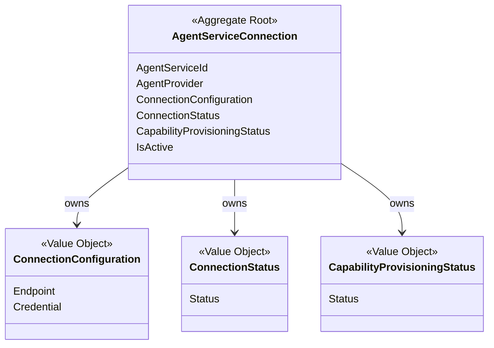
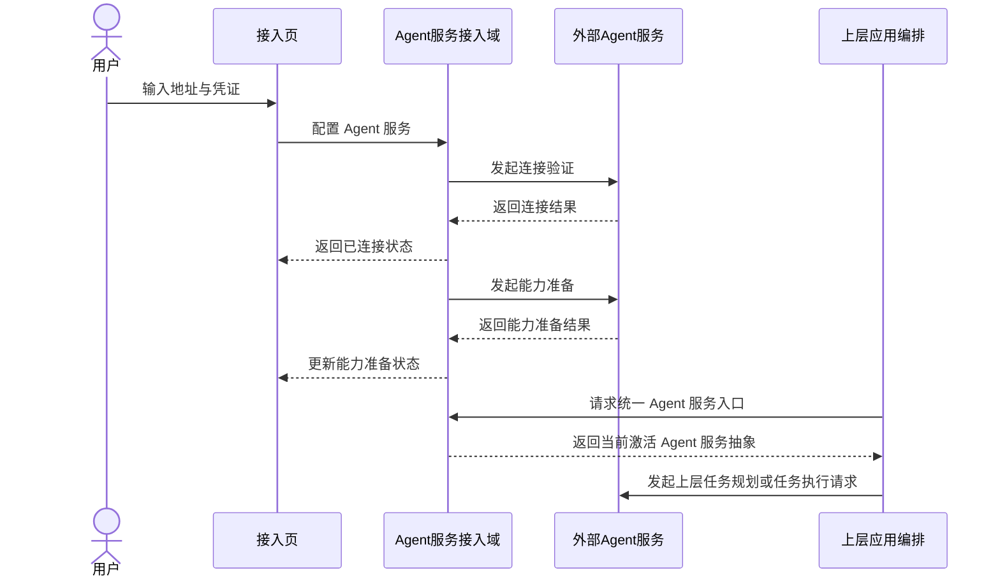

# Cybernomads Agent服务接入领域设计文档

## 1. 顶层共识与统一语言 (Ubiquitous Language)

### 1.1 模块职责边界 (Bounded Context)
- **包含**：管理系统当前连接的外部 Agent 服务及其接入配置。
- **包含**：管理 Agent 服务的连接验证、连接状态、当前激活服务选择以及能力准备状态。
- **包含**：向上层应用编排提供统一的 Agent 服务调用入口，屏蔽 OpenClaw 或未来其他 Agent 服务的实现差异。
- **包含**：管理 Cybernomads 所需能力准备过程，例如让 Agent 服务具备所需 Skill 或等价能力。
- **不包含**：任务如何拆分、引流工作如何规划、任务如何调度、日志如何回写。
- **不包含**：平台脚本如何执行、subagent 内部调度机制如何实现、OpenClaw 具体接口细节如何调用。
- **不包含**：引流工作生命周期、任务生命周期、策略编译过程和对象绑定解析。

在 Cybernomads 当前阶段，系统面对的不是“一个单独 Agent”，而是“一个外部 Agent 服务入口”。因此该领域的核心不是 AI 如何思考，而是系统如何稳定地连接、识别、准备并使用这个外部 Agent 服务。

### 1.2 核心业务词汇表 (Glossary)
- **Agent服务 (Agent Service)**：Cybernomads 对接的外部 AI 执行服务，是系统统一的外部执行入口。
- **Agent提供方 (Agent Provider)**：Agent 服务的来源或类型，例如 OpenClaw、未来 SaaS Agent 或自研 Agent 服务。
- **Agent网关 (Agent Gateway)**：具备会话、消息、subagent 等原子能力的外部服务入口。
- **接入配置 (Connection Configuration)**：连接 Agent 服务所需的地址、端口、凭证等配置集合。
- **连接验证 (Connection Verification)**：系统主动检测 Agent 服务是否可访问、是否能正常响应的行为。
- **连接状态 (Connection Status)**：当前 Agent 服务在系统中的接入状态，例如未配置、已连接、连接异常。
- **能力准备 (Capability Provisioning)**：系统确保 Agent 服务具备 Cybernomads 所需能力的过程，当前实现可通过提示词驱动完成。
- **能力准备状态 (Capability Provisioning Status)**：当前 Agent 服务是否已经完成 Cybernomads 所需能力准备的业务状态。
- **当前激活服务 (Active Agent Service)**：当前系统唯一使用中的 Agent 服务入口。
- **原子能力 (Atomic Capability)**：Agent 服务本身提供的底层能力，例如会话创建、消息发送、查询会话记录、调用 subagent。
- **任务规划请求 (Task Planning Request)**：上层应用将产品内容与策略内容交给 Agent 服务，请其拆分任务的业务请求。
- **任务执行请求 (Task Execution Request)**：上层应用将任务信息与工作上下文交给 Agent 服务，请其执行任务的业务请求。

## 2. 领域模型与聚合关系 (Domain Models & Aggregates)

当前 Agent 服务接入域建议采用单聚合根设计：
- `AgentServiceConnection` 是聚合根，表达“系统当前如何连接并使用一个外部 Agent 服务”。
- `ConnectionConfiguration` 是值对象，承载连接所需配置。
- `ConnectionStatus` 是值对象，表达当前连接是否成功、是否异常。
- `CapabilityProvisioningStatus` 是值对象，表达当前 Agent 服务是否已完成 Cybernomads 所需能力准备。

这个聚合根的职责不是定义上层任务语义，而是保证系统始终围绕“一个当前激活的 Agent 服务连接关系”来工作，并能稳定向上层暴露统一入口。

## 3. 核心业务约束 (Invariants & Business Rules)

- **单服务约束**：在当前 MVP 阶段，系统只允许存在一个当前激活的 Agent 服务入口，不支持多个外部 Agent 服务并行接入。
- **单激活约束**：任一时刻最多只有一个 AgentServiceConnection 处于激活状态。
- **接入前置约束**：只有完成有效接入配置的 Agent 服务，才能进入连接验证流程。
- **连接成功约束**：在当前 MVP 语义下，连接成功即可视为当前 Agent 服务可被系统使用，不额外引入独立“可执行状态”作为用户侧主状态。
- **能力准备从属约束**：能力准备属于 Agent 服务接入域的子能力，但不改变“系统只连接一个 Agent 服务入口”的主业务语义。
- **实现解耦约束**：上层业务只能依赖 Agent 服务抽象，不得直接依赖 OpenClaw 或未来具体 Agent 服务的接口细节。
- **原子能力约束**：Agent 服务域对上提供的是原子能力入口，而不是任务规划、任务调度、引流策略编排等完整上层业务能力。
- **影响传递约束**：如果用户修改 Agent 服务连接信息或 Agent 服务中断，当前已有引流工作会受到影响；MVP 阶段暂不提供容灾与自动恢复能力。
- **能力准备一致性约束**：系统一旦声明某个 Agent 服务已完成能力准备，则该服务应具备 Cybernomads 所需的最小运行能力。
- **服务替换约束**：从 OpenClaw 切换到其他 Agent 服务时，应只影响实现层，不影响上层业务模型和调用语义。

## 4. 核心用例与行为流转 (Core Behaviors)

### 4.1 用户故事 (User Stories)
- **用户故事 1**：作为用户，我希望配置并连接一个 Agent 服务，以便 Cybernomads 能拥有统一的外部 AI 执行入口。
  - **验收标准 (AC)**：当我提交有效接入配置后，系统能够完成连接验证并显示当前 Agent 服务已连接。

- **用户故事 2**：作为用户，我希望在当前阶段只维护一个激活中的 Agent 服务，以便系统行为简单明确，不需要在多个服务之间手动切换路由。
  - **验收标准 (AC)**：任一时刻系统只展示并使用一个当前激活的 Agent 服务入口。

- **用户故事 3**：作为系统，我希望在 Agent 服务接入后完成 Cybernomads 所需能力准备，以便后续上层流程能够安全地调用外部 Agent 服务。
  - **验收标准 (AC)**：当连接成功后，系统能够发起能力准备过程，并记录能力准备状态。

- **用户故事 4**：作为上层业务编排者，我希望通过统一抽象与 Agent 服务交互，以便未来切换 OpenClaw、SaaS Agent 或自研 Agent 时不影响上层业务逻辑。
  - **验收标准 (AC)**：上层调用语义不绑定 OpenClaw 专有接口，而是依赖统一 Agent 服务抽象。

- **用户故事 5**：作为用户，我希望当 Agent 服务连接变更或中断时能够明确感知风险，以便我自行处理当前已有工作区或引流工作的影响。
  - **验收标准 (AC)**：系统能够明确暴露连接异常或变更后的状态，但当前阶段不承诺自动容灾恢复。

### 4.2 核心领域事件/命令 (Commands & Events)
- **命令 (Command)**：`ConfigureAgentServiceCommand`（配置 Agent 服务）
- **命令 (Command)**：`VerifyAgentConnectionCommand`（验证 Agent 服务连接）
- **命令 (Command)**：`ActivateAgentServiceCommand`（激活 Agent 服务）
- **命令 (Command)**：`PrepareAgentCapabilitiesCommand`（准备 Agent 服务能力）
- **命令 (Command)**：`UpdateAgentConnectionCommand`（更新 Agent 服务连接信息）
- **事件 (Event)**：`AgentServiceConfiguredEvent`（Agent 服务已配置）
- **事件 (Event)**：`AgentServiceConnectedEvent`（Agent 服务已连接）
- **事件 (Event)**：`AgentCapabilitiesPreparedEvent`（Agent 服务能力已准备）
- **事件 (Event)**：`AgentConnectionUpdatedEvent`（Agent 服务连接信息已更新）
- **事件 (Event)**：`AgentConnectionFailedEvent`（Agent 服务连接失败）

### 4.3 核心业务流图 (Behavior Flow)

这条业务流强调的是：
- Agent 服务接入域负责把一个外部 Agent 服务接进系统并准备好。
- 上层应用编排再基于这个统一入口去形成“任务规划请求”或“任务执行请求”。
- 因此，“任务规划”和“任务执行”不是 Agent 服务接入域自己的领域能力，而是上层对 Agent 原子能力的组合使用。
