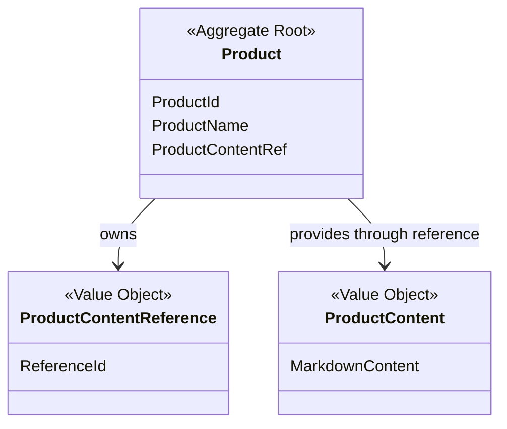
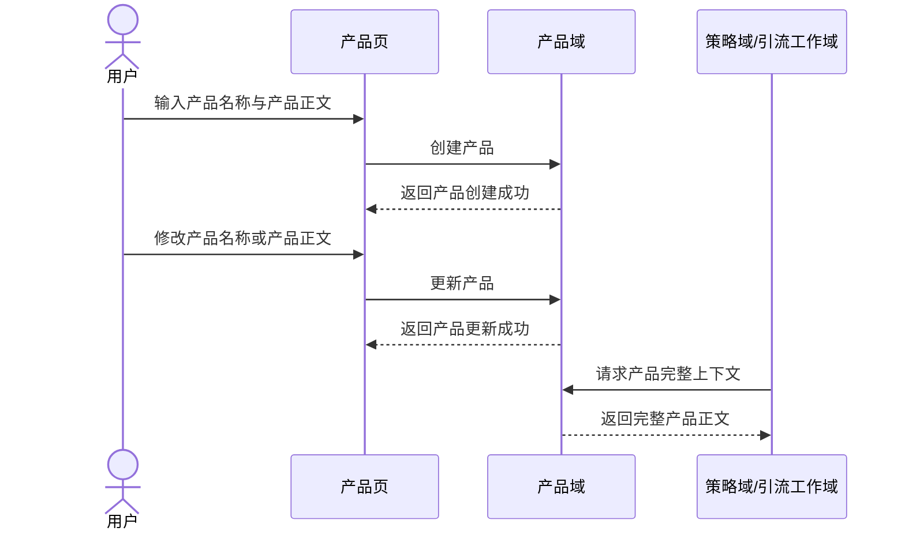

# Cybernomads 产品领域设计文档

## 1. 顶层共识与统一语言 (Ubiquitous Language)

### 1.1 模块职责边界 (Bounded Context)
- **包含**：定义“当前在推广什么”的产品业务对象，并承载该产品的核心介绍内容。
- **包含**：管理产品的最小业务属性，例如产品标识、产品名称、产品正文内容或正文引用关系。
- **包含**：向策略域、引流工作域和任务域提供完整、稳定的产品上下文，供 AI 理解当前推广对象。
- **不包含**：策略编排、对象绑定、引流工作生命周期、任务调度和执行日志。
- **不包含**：产品审核、发布、归档、版本快照、多阶段状态机等超出 MVP 的复杂产品管理能力。
- **不包含**：数据库表结构、文件存储路径、端口接口、双写顺序、跨存储迁移等基础设施设计。

在 Cybernomads 的 MVP 阶段，产品域不是内容管理系统，也不是复杂商品中心。它更像一个稳定的“产品语义载体”，负责回答 AI 一个核心问题：当前要推广的到底是什么。

### 1.2 核心业务词汇表 (Glossary)
- **产品 (Product)**：用户创建的核心业务对象，用于描述当前正在推广的产品。
- **产品标识 (Product Identifier)**：用于唯一识别某个产品的稳定标识。
- **产品名称 (Product Name)**：产品的可读名称，用于用户识别、列表展示和绑定选择。
- **产品正文 (Product Content)**：用于介绍产品的完整 Markdown 内容，是 AI 理解产品的主要上下文。
- **产品正文引用 (Product Content Reference)**：产品与其正文内容之间的稳定关联关系，用于表达“这个产品对应哪份正文内容”。
- **产品摘要信息 (Product Summary)**：用于列表展示和快速选择的最小产品信息集合，通常不等于完整正文。
- **产品完整上下文 (Full Product Context)**：提供给策略域、引流工作域或任务域的完整产品介绍内容，而不是截断摘要。

## 2. 领域模型与聚合关系 (Domain Models & Aggregates)

产品域当前建议保持单聚合根设计：
- `Product` 是产品域的聚合根，负责表达“一个可被推广、可被选择、可被 AI 理解的产品对象”。
- `ProductContentReference` 是值对象，用于表达产品与正文内容之间的稳定关联。
- `ProductContent` 是值对象，承载完整 Markdown 正文，是产品语义的核心载体。

在领域语义上，`Product` 的职责不是管理复杂状态流转，而是保证“一个产品对象始终能关联到一份完整、可读取的产品正文”，从而为其他领域提供稳定输入。

## 3. 核心业务约束 (Invariants & Business Rules)

- **完整性约束**：一个可被使用的产品必须具备有效的产品名称与可读取的产品正文引用关系。
- **单正文约束**：在当前 MVP 设计下，一个产品只对应一份有效正文，不引入多版本正文并存。
- **语义稳定约束**：产品的核心职责是表达“推广对象是什么”，不能在产品域中混入策略、账号、任务或平台执行语义。
- **最小化约束**：产品域不引入草稿、发布、归档、审核、版本链等复杂状态流转。
- **完整上下文约束**：当其他领域请求产品上下文时，产品域提供的应是完整产品正文，而不是仅返回名称或摘要。
- **可选择性约束**：只有满足完整性约束的产品，才应被允许进入策略绑定、引流工作选择或任务规划流程。
- **更新一致性约束**：产品更新后，对外暴露的产品名称与产品正文应保持一致，不允许出现名称已变更但正文仍指向旧语义的状态。
- **单对象语义约束**：一个产品对象在当前阶段只表达一个推广主体，不承担组合产品包、多语言版本组、产品矩阵等复杂建模职责。

## 4. 核心用例与行为流转 (Core Behaviors)

### 4.1 用户故事 (User Stories)
- **用户故事 1**：作为用户，我希望创建一个产品并填写产品名称与产品正文，以便系统能够保存一份可供 AI 理解的推广对象描述。
  - **验收标准 (AC)**：创建成功后，系统中存在一个可被识别和查询的产品对象，且该产品可提供完整正文内容。

- **用户故事 2**：作为用户，我希望在产品列表中看到已有产品的摘要信息，以便我在创建策略或引流工作时快速选择目标产品。
  - **验收标准 (AC)**：产品列表至少能够稳定展示用于识别和选择的最小产品信息。

- **用户故事 3**：作为策略或引流工作使用方，我希望在需要时获取产品完整上下文，以便 AI 能基于完整产品介绍进行理解和规划，而不是依赖残缺摘要。
  - **验收标准 (AC)**：当系统请求完整产品上下文时，返回结果应包含完整产品正文。

- **用户故事 4**：作为用户，我希望更新已有产品的名称或正文内容，以便产品描述能够随着推广目标调整而保持最新。
  - **验收标准 (AC)**：更新成功后，系统对外提供的产品名称与完整正文内容均为最新版本。

### 4.2 核心领域事件/命令 (Commands & Events)
- **命令 (Command)**：`CreateProductCommand`（创建产品）
- **命令 (Command)**：`UpdateProductCommand`（更新产品）
- **命令 (Command)**：`GetProductSummaryCommand`（获取产品摘要信息）
- **命令 (Command)**：`GetProductContextCommand`（获取产品完整上下文）
- **事件 (Event)**：`ProductCreatedEvent`（产品已创建）
- **事件 (Event)**：`ProductUpdatedEvent`（产品已更新）
- **事件 (Event)**：`ProductContextProvidedEvent`（产品完整上下文已提供）

### 4.3 核心业务流图 (Behavior Flow)

这条核心行为流表达的是产品域最小闭环：
- 用户创建产品，定义“当前推广的是什么”。
- 用户更新产品，保证产品语义持续有效。
- 其他领域在需要时读取产品完整上下文，将其作为 AI 理解与规划的输入材料。

在这个闭环中，产品域只负责“定义和提供产品语义”，不负责“如何推广”、"由谁执行"或“执行结果如何”。
