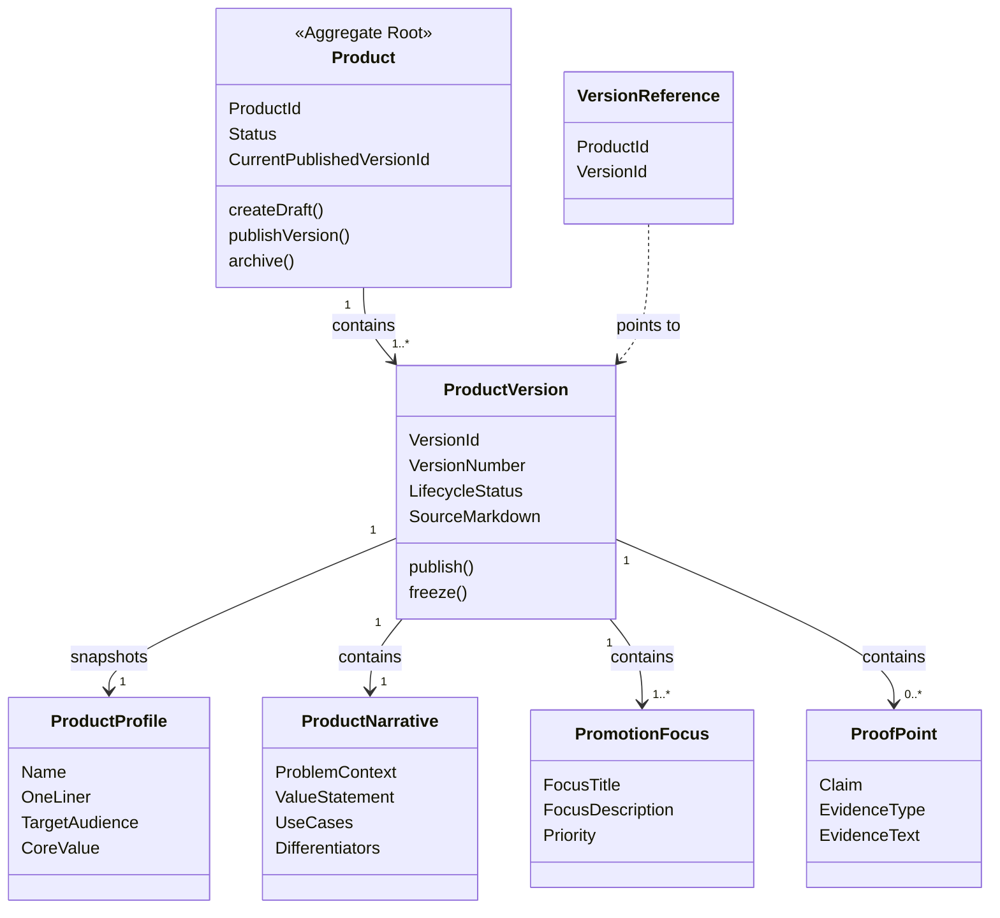
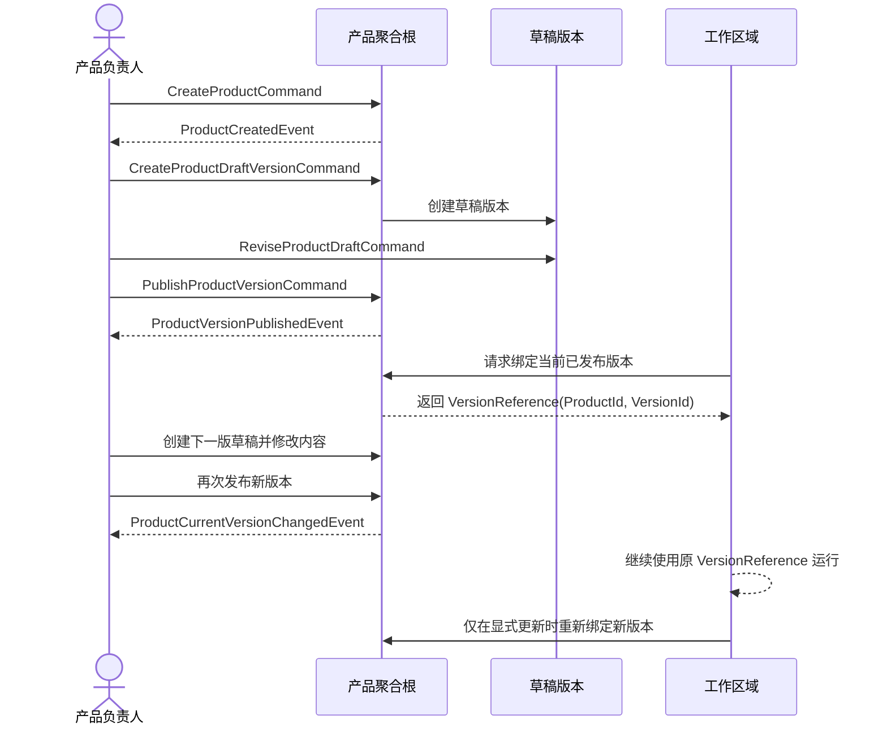

# Cybernomads 产品领域设计文档

## 1. 顶层共识与统一语言 (Ubiquitous Language)

### 1.1 模块职责边界 (Bounded Context)
- **包含**：管理产品的主档信息、传播重点、结构化产品叙事、Markdown 原文以及版本化演进。
- **包含**：为策略域、工作区域和任务规划提供稳定、可引用、可追溯的产品上下文。
- **不包含**：策略编排、品牌语气、人设设计与平台执行动作，这些属于策略域或平台能力域。
- **不包含**：账号绑定、工作区生命周期、任务调度与执行日志，这些属于资源绑定域、引流工作域和任务域。
- **不包含**：数据库表结构、存储介质与缓存策略，这些属于基础设施实现。

产品域的核心职责不是“帮用户写策略”，而是维护“我们到底在推广什么”的唯一业务真相来源。它产出的不是执行动作，而是可被其他上下文稳定引用的产品语义资产。

### 1.2 核心业务词汇表 (Glossary)
- **产品 (Product)**：平台内可被持续推广的业务对象，是产品域的聚合根，代表一个稳定存在的推广主体。
- **产品主档 (Product Profile)**：产品的基础身份信息集合，包括名称、一句话说明、目标用户和核心价值，用于表达产品是什么。
- **产品版本 (Product Version)**：某一时刻可供业务使用的产品内容快照，承载具体的传播叙事与宣传重点。
- **草稿版本 (Draft Version)**：尚未对外成为引用基线的产品版本，可继续编辑但不可直接作为执行基线。
- **已发布版本 (Published Version)**：可被工作区、策略编译或任务规划稳定引用的产品版本，一经发布即冻结内容。
- **当前版本 (Current Version)**：产品当前推荐给新工作区绑定的已发布版本，不等于历史上唯一版本。
- **产品叙事 (Product Narrative)**：围绕产品价值、用户痛点、适用场景和差异化卖点的结构化表达。
- **传播重点 (Promotion Focus)**：允许被策略和 Agent 优先提取的核心卖点列表，是产品叙事中的高优先级片段。
- **证据点 (Proof Point)**：支持卖点成立的事实依据，例如真实能力、功能特性、案例或边界说明。
- **绑定快照 (Binding Snapshot)**：工作区引用某个产品版本时形成的稳定上下文引用，保证执行期语义不漂移。
- **归档 (Archive)**：产品在业务上停止新增使用，但保留历史版本与引用关系用于追溯。

## 2. 领域模型与聚合关系 (Domain Models & Aggregates)

产品域采用 `Product` 作为聚合根，核心一致性边界放在“产品是什么”及“哪个版本可以被外部稳定引用”上，而不是放在执行期动作上。

其中最关键的建模决策有三点：
- `Product` 负责身份与生命周期，`ProductVersion` 负责具体内容快照，两者分离后才能同时支持“持续迭代”与“历史可追溯”。
- `ProductVersion` 是被外部上下文消费的最小稳定单元，而不是可变的 `Product` 主对象。
- 工作区、策略编译和任务规划只应引用 `VersionReference`，避免产品内容被修改后影响正在运行的引流任务。

## 3. 核心业务约束 (Invariants & Business Rules)

- **唯一聚合根约束**：一个产品只能有一个 `Product` 聚合根，所有版本、状态变更和归档行为都必须通过该聚合根完成。
- **最小内容完整性约束**：任何产品版本在发布前，必须至少包含产品名称、一句话说明、目标用户、核心价值和至少一条传播重点。
- **发布冻结约束**：已发布版本不可原地修改。任何内容变更都必须创建新的草稿版本，再经发布成为新的已发布版本。
- **单当前版本约束**：同一产品在任一时刻只能存在一个“当前版本”指针，但可以存在多个历史已发布版本。
- **绑定稳定性约束**：工作区或任务一旦绑定某个产品版本，后续产品新增版本不会自动覆盖既有绑定，除非显式发起重新绑定。
- **真实性约束**：传播重点必须能被产品叙事或证据点支撑，产品域不接受纯策略性口号冒充产品事实。
- **边界清晰约束**：产品域只维护产品事实与传播素材，不负责定义平台动作、评论话术、私信节奏或账号人格。
- **归档保护约束**：已被工作区引用或已有执行历史的产品不得直接物理删除，只能归档，以保证执行日志和历史任务可回溯。
- **版本序号单调递增约束**：同一产品下的版本号必须单调递增，禁止重用历史版本号。
- **Markdown 与结构化内容一致性约束**：如果系统同时保存 Markdown 原文和结构化字段，发布时二者必须来自同一编辑结果，不能出现语义不一致的双源事实。

## 4. 核心用例与行为流转 (Core Behaviors)

### 4.1 用户故事 (User Stories)
- **用户故事 1**：作为产品负责人，我希望创建一个产品并维护它的核心价值与目标用户，以便于后续策略和工作区都围绕同一份产品事实开展工作。
  - **验收标准 (AC)**：创建产品时，如果缺少名称、目标用户或核心价值，系统不得允许将该内容发布为可引用版本。

- **用户故事 2**：作为增长负责人，我希望在不影响正在运行工作区的前提下更新产品表达，以便于在新一轮引流中使用更准确的产品叙事。
  - **验收标准 (AC)**：当某个产品已有已发布版本被工作区使用时，编辑行为必须生成新的草稿版本，而不是覆盖旧版本。

- **用户故事 3**：作为工作区创建者，我希望绑定一个明确的产品版本，而不是绑定一个随时会变化的产品对象，以便于任务执行上下文稳定可追溯。
  - **验收标准 (AC)**：工作区保存绑定后，即使产品发布了新版本，既有工作区仍继续引用原版本，直到用户主动更新绑定。

- **用户故事 4**：作为产品负责人，我希望归档不再主推的产品，但保留历史记录，以便于后续回看哪些版本在什么策略和工作区中产生过效果。
  - **验收标准 (AC)**：存在历史绑定或执行记录的产品只能归档，不能硬删除；归档后不得再作为新工作区的默认可选产品。

- **用户故事 5**：作为策略编写者，我希望读取结构化的产品传播重点和证据点，以便于把策略建立在真实产品事实上，而不是临时拼凑营销文案。
  - **验收标准 (AC)**：策略侧读取产品上下文时，至少能拿到当前绑定版本的产品主档、传播重点和证据点。

### 4.2 核心领域事件/命令 (Commands & Events)
- **命令 (Command)**：`CreateProductCommand`（创建产品）
- **命令 (Command)**：`CreateProductDraftVersionCommand`（创建产品草稿版本）
- **命令 (Command)**：`ReviseProductDraftCommand`（修改产品草稿）
- **命令 (Command)**：`PublishProductVersionCommand`（发布产品版本）
- **命令 (Command)**：`ArchiveProductCommand`（归档产品）
- **事件 (Event)**：`ProductCreatedEvent`（产品已创建）
- **事件 (Event)**：`ProductDraftVersionCreatedEvent`（产品草稿版本已创建）
- **事件 (Event)**：`ProductVersionPublishedEvent`（产品版本已发布）
- **事件 (Event)**：`ProductCurrentVersionChangedEvent`（产品当前版本已切换）
- **事件 (Event)**：`ProductArchivedEvent`（产品已归档）

### 4.3 核心业务流图 (Behavior Flow)

这条主流程表达了产品域最重要的业务闭环：
- 先有产品身份，再有可演进的内容版本。
- 发布行为把“可编辑内容”转成“可被外部稳定引用的事实快照”。
- 工作区消费的是版本引用而不是实时对象，因此产品可持续迭代，执行上下文仍保持稳定。

从领域设计角度看，这个约束直接决定了后续策略编译、任务规划、执行日志和复盘是否具备可解释性。如果没有版本级绑定，系统后期几乎无法回答“这次执行当时用的到底是哪份产品信息”。
