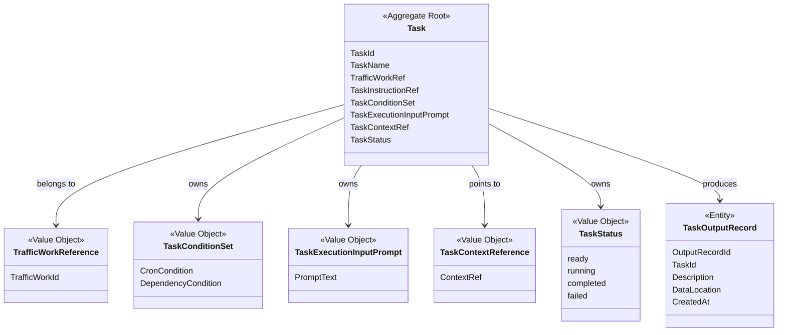
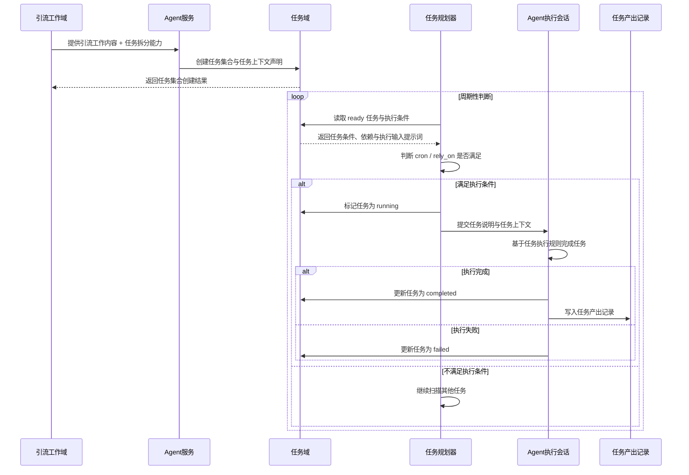

# Cybernomads 任务领域设计文档

## 1. 顶层共识与统一语言 (Ubiquitous Language)

### 1.1 模块职责边界 (Bounded Context)

- **包含**：定义“任务”这一稳定业务对象，承载任务名称、任务标识、所属引流工作、任务说明、任务状态、执行条件、执行输入提示词和任务上下文引用等核心语义。
- **包含**：管理任务从被创建、等待执行、运行中、完成到失败的最小生命周期状态。
- **包含**：表达任务之间的依赖关系、任务对上游产出数据的需求，以及任务是否具备被规划器驱动执行的条件。
- **包含**：管理任务产出记录的抽象语义，用于追踪任务在执行过程中产生了什么、产物在哪里、由哪个任务产生。
- **包含**：向任务规划器、执行台和其他领域提供任务摘要、任务详情、任务状态和任务产出记录查询语义。
- **不包含**：引流工作如何创建、暂停、更新、结束、归档和删除；这些属于引流工作域。
- **不包含**：Agent 服务如何接入、会话如何创建、subagent 如何调度、OpenClaw 或其他 provider 如何调用；这些属于 Agent 服务接入域或实现层。
- **不包含**：任务规划器的具体扫描线程、轮询间隔、并发控制、调度算法和失败重试机制。
- **不包含**：平台脚本如何执行、B 站 API 如何调用、工具脚本如何落盘和运行。
- **不包含**：任务产出数据的具体结构，例如视频数据、评论数据、私信数据、图片、文章等不同产物的内部字段。
- **不包含**：数据库表结构、文件夹路径、Markdown 文件命名、产物文件格式和本地文件系统读写方式等基础设施实现细节。

在 Cybernomads 当前阶段，任务域不是“线程规划器”，也不是“Agent 服务执行器”。它更像是引流工作内部的一组可被理解、可被调度、可被协作的原子工作单元，负责回答这些核心问题：这项任务是什么、属于哪个引流工作、执行前需要什么、依赖哪些任务、当前处于什么状态、执行后产生了哪些可追踪产物。

任务本质上可以理解为一份“任务关键信息上下文 + 可用工具说明”的业务对象。它类似一个面向 Agent 的小型执行说明，但在领域语义上仍然是 Cybernomads 管理的任务对象，而不是 Agent Skill 本身。

### 1.2 核心业务词汇表 (Glossary)

- **任务 (Task)**：由 Agent 基于引流工作分析拆分出来的、可独立执行的原子工作单元。
- **任务标识 (Task Identifier)**：系统内部用于唯一识别某个任务的稳定标识。
- **任务名称 (Task Name)**：任务的人类可读名称，用于列表展示、执行台观察和人工辨认。
- **所属引流工作 (Owner Traffic Work)**：任务归属的引流工作；任务不能脱离引流工作独立存在。
- **任务说明 (Task Instruction)**：面向 Agent / subagent 的任务执行说明，描述任务目标、工作流程、可用工具和注意事项。
- **任务上下文引用 (Task Context Reference)**：任务执行时可加载的上下文引用，表达“该任务有一组可被 Agent 消费的任务上下文”，不绑定具体文件路径。
- **任务文档引用 (Task Document Reference)**：任务说明文档的稳定引用，语义上表达“当前任务的说明入口”，不等同于具体操作系统路径。
- **执行条件 (Task Condition)**：用于判断任务是否具备被规划器驱动执行条件的声明集合，当前包含定时条件和依赖条件两类。
- **定时条件 (Cron Condition)**：表达任务按某种时间节奏被考虑执行的条件，语义上可参考 cron 表达式。
- **依赖条件 (Dependency Condition)**：表达当前任务依赖哪些上游任务完成或产出更新后才能被考虑执行。
- **执行输入提示词 (Task Execution Input Prompt)**：由任务拆分 Agent 生成、供任务执行 Agent 消费的一段提示词，用于说明任务执行前需要哪些输入，以及应如何找到、理解和消费这些输入。
- **任务状态 (Task Status)**：任务当前所处的最小生命周期状态，当前固定为 `ready`、`running`、`completed`、`failed`。
- **就绪 (Ready)**：任务已被创建并可被规划器纳入判断范围，但不代表一定马上可执行；是否可执行还需要结合执行条件判断。
- **运行中 (Running)**：任务已经被规划器提交给 Agent 服务执行，处于执行过程。
- **完成 (Completed)**：任务执行结束，并由 Agent 按任务执行规则将状态更新为完成。
- **失败 (Failed)**：任务执行未达成目标，并由 Agent 按任务执行规则将状态更新为失败。
- **任务产出数据 (Task Output Data)**：任务执行过程中实际产生的业务数据或文件，例如备选视频、评论记录、私信内容、图片、文章等。
- **任务数据存储区域 (Task Data Area)**：某个引流工作上下文内用于承载任务详细产出数据的概念区域；其内部结构由任务拆分与执行过程规划，不属于任务域固定模型。
- **任务产出记录 (Task Output Record)**：任务对其产出数据进行抽象归档后形成的可追踪记录，至少说明由哪个任务产生、产出是什么、产物在哪里和何时创建。
- **任务协作 (Task Collaboration)**：任务之间通过依赖条件、执行输入提示词和产出记录形成的数据协作关系，例如 Task2 使用 Task1 产出的备选视频数据继续评论。
- **任务拆分 (Task Decomposition)**：Agent 基于引流工作内容和任务拆分能力，将一份引流工作拆分为多个任务的过程。
- **任务执行 (Task Execution)**：任务被规划器驱动后，由 Agent 服务基于任务说明和上下文执行的过程。
- **任务规划器 (Task Planner)**：驱动任务被执行的上层规划能力；当前 MVP 以线程规划为主，未来可扩展为 Agent 规划。

## 2. 领域模型与聚合关系 (Domain Models & Aggregates)

任务域当前建议采用以 `Task` 为聚合根的设计：

- `Task` 是任务域的聚合根，负责表达“一个被拆分出来、可被规划器判断、可被 Agent 执行的原子任务”。
- `TrafficWorkReference` 是值对象，用于表达任务归属于哪个引流工作；任务不能脱离引流工作存在。
- `TaskConditionSet` 是值对象，用于表达任务执行条件。当前至少包含定时条件和依赖条件，但不要求每个任务都同时具备这两类条件。
- `TaskExecutionInputPrompt` 是值对象，用于表达任务执行所需输入及其获取说明。它不直接等同于数据本体，而是一段由 Agent 生成、供 Agent 消费的执行提示词。
- `TaskContextReference` 是值对象，用于表达任务执行可加载的上下文引用，不绑定具体文件系统路径。
- `TaskStatus` 是值对象，用于表达任务当前的最小状态。当前坚持轻量状态机，避免复杂状态流转导致 Agent 执行过程混乱。
- `TaskOutputRecord` 是聚合内或从属于任务的实体，用于抽象记录任务产出数据。它不承载产出数据本体，只承载追踪与索引语义。

在领域语义上，`Task` 的关键职责不是“亲自执行平台动作”，也不是“决定调度算法”，而是保证每个任务都具备足够清晰的执行说明、执行输入提示词、依赖条件、状态和产出追踪能力。

任务域需要同时支持两种协作关系：

- **执行协作**：通过 `TaskConditionSet` 表达任务之间的前后依赖，例如 Task2 依赖 Task1。
- **数据协作**：通过 `TaskExecutionInputPrompt` 与 `TaskOutputRecord` 表达任务之间如何获取和消费产出，例如 Task2 从 Task1 的产出记录或任务数据区域中获取备选视频数据。

这两种协作关系不能混为一谈。一个任务依赖另一个任务完成，通常是为了获得某类上游数据，但任务域仍应分别表达“依赖谁”和“需要什么输入”。

## 3. 核心业务约束 (Invariants & Business Rules)

- **归属约束**：任务必须归属于某个引流工作，不允许脱离引流工作独立存在。
- **创建来源约束**：任务由 Agent 基于引流工作内容和任务拆分能力创建；普通用户不直接手工编写完整任务集合。
- **原子化约束**：任务应尽量保持目标单一、流程清晰、上下文可控，避免单个任务过大导致 Agent 执行时上下文窗口压力过高。
- **说明完整约束**：任务必须具备足够的任务说明，说明任务目标、执行流程、可用工具、执行输入提示词和产出要求。
- **上下文引用约束**：任务可以引用所属引流工作的上下文空间，但任务域只表达上下文引用关系，不定义具体文件夹结构和文件路径。
- **条件声明约束**：任务可以具备定时条件、依赖条件或两者组合；没有必要强制每个任务都同时具备所有条件。
- **就绪非可执行约束**：`ready` 只表示任务进入可被规划器判断的状态，不等同于当前一定可执行；是否可执行由执行条件在规划阶段判断。
- **运行互斥约束**：同一个任务处于 `running` 时，不应被重复提交执行；是否支持并行执行不属于当前 MVP 范围。
- **轻量状态约束**：当前任务状态固定为 `ready`、`running`、`completed`、`failed`，不引入复杂状态机、重试中、阻塞中、取消中等额外状态。
- **失败简化约束**：任务失败由 Agent 在执行任务时基于任务执行规则判断并更新状态；当前任务域不定义自动重试、手动恢复和复杂容灾流程。
- **依赖判断约束**：依赖条件表达任务之间存在前置关系；当前线程规划可基于依赖任务更新时间与当前任务更新时间判断是否具备再次执行条件，但该判断算法属于规划实现，不属于任务领域模型本体。
- **执行输入提示词约束**：任务需要声明一段可被 Agent 消费的执行输入提示词，用于说明所需输入数据以及 Agent 获取数据的方式；该提示词不得退化成只有自然语言目标而缺少数据来源说明。
- **产出本体开放约束**：任务产出的具体数据类型和结构由任务拆分与执行过程规划，不在任务域中提前枚举或固定。
- **产出记录最小化约束**：任务产出记录只保存抽象追踪信息，至少包含记录标识、任务标识、产出描述、数据位置和创建时间，不承载具体产出数据本体。
- **协作可追踪约束**：当一个任务需要使用另一个任务的产出时，应能通过执行输入提示词、产出记录或任务上下文说明找到对应数据，而不是依赖隐式口头约定。
- **策略解耦约束**：策略只表达引流战术和方法论，不负责描述平台底层工具、具体数据存储方式或任务产物结构。
- **执行解耦约束**：任务域不关心 OpenClaw、SaaS Agent 或自研 Agent 的具体执行协议；它只表达任务可以被 Agent 服务执行。
- **日志解耦约束**：任务域只管理任务状态与产出记录，不定义完整日志系统、操作流水和详细观测事件结构。
- **更新重建约束**：引流工作更新后的任务变化以引流工作域的更新重建语义为准；任务域不单独定义引流工作更新策略。

## 4. 核心用例与行为流转 (Core Behaviors)

### 4.1 用户故事 (User Stories)

- **用户故事 1**：作为系统，我希望 Agent 能够基于引流工作内容拆分出多个原子化任务，以便一份复杂引流工作可以被分解为多个可独立执行的工作单元。
  - **验收标准 (AC)**：任务拆分完成后，系统中存在多个归属于同一引流工作的任务，每个任务都有任务标识、任务名称、任务说明、执行条件、执行输入提示词和初始状态。

- **用户故事 2**：作为系统，我希望任务能够声明定时条件和依赖条件，以便任务规划器可以判断某个任务当前是否应当被执行。
  - **验收标准 (AC)**：任务可以独立声明 `cron` 或 `rely_on` 条件，也可以同时声明两者；规划器能够读取这些条件进行执行判断。

- **用户故事 3**：作为 Agent，我希望每个任务都能提供清晰的执行输入提示词，说明自己需要哪些输入数据以及如何获取这些数据，以便执行任务时不需要重新猜测上下游协作方式。
  - **验收标准 (AC)**：任务详情中能够表达执行输入提示词，例如需要从某个上游任务产出或任务数据区域中获取备选视频数据。

- **用户故事 4**：作为任务规划器，我希望只驱动满足执行条件且未处于运行中的任务，以便任务不会被无意义重复提交，也不会在依赖数据尚未准备好时执行。
  - **验收标准 (AC)**：任务处于 `ready` 时仍需满足执行条件才会被提交；任务处于 `running` 时不会被重复提交。

- **用户故事 5**：作为 Agent，我希望在执行任务时能够根据任务说明和任务上下文完成目标，并在执行结束后更新任务状态，以便系统能够持续观察任务推进情况。
  - **验收标准 (AC)**：任务执行后状态会被更新为 `completed` 或 `failed`，失败原因和后续处理方式由任务执行规则指导 Agent 处理。

- **用户故事 6**：作为用户或执行观察者，我希望看到任务产出了哪些可追踪结果，以便理解任务执行价值、排查问题，并让后续任务可以引用这些产出。
  - **验收标准 (AC)**：当任务产生数据后，系统至少可以查询到对应任务产出记录，包含产出描述、数据位置和创建时间。

### 4.2 核心领域事件/命令 (Commands & Events)

- **命令 (Command)**：`CreateTaskCommand`（创建任务）
- **命令 (Command)**：`CreateTaskSetFromTrafficWorkCommand`（基于引流工作创建任务集合）
- **命令 (Command)**：`UpdateTaskStatusCommand`（更新任务状态）
- **命令 (Command)**：`EvaluateTaskConditionCommand`（评估任务执行条件）
- **命令 (Command)**：`GetTaskSummaryCommand`（获取任务摘要）
- **命令 (Command)**：`GetTaskDetailCommand`（获取任务详情）
- **命令 (Command)**：`CreateTaskOutputRecordCommand`（创建任务产出记录）
- **命令 (Command)**：`ListTaskOutputRecordsCommand`（查询任务产出记录）
- **事件 (Event)**：`TaskCreatedEvent`（任务已创建）
- **事件 (Event)**：`TaskSetCreatedEvent`（任务集合已创建）
- **事件 (Event)**：`TaskStatusChangedEvent`（任务状态已变更）
- **事件 (Event)**：`TaskExecutionRequestedEvent`（任务执行已被请求）
- **事件 (Event)**：`TaskCompletedEvent`（任务已完成）
- **事件 (Event)**：`TaskFailedEvent`（任务已失败）
- **事件 (Event)**：`TaskOutputRecordedEvent`（任务产出已记录）

### 4.3 核心业务流图 (Behavior Flow)

这条核心业务流表达的是任务域的稳定闭环：

- 任务由 Agent 基于引流工作内容拆分创建，但任务一旦创建，就成为系统可管理的业务对象。
- 任务规划器负责判断任务是否应当被执行，但任务域负责提供可被判断的条件、依赖、执行输入提示词和状态。
- Agent 执行任务后负责根据任务执行规则更新任务状态，并在产生数据时写入任务产出记录。
- 任务产出数据本体可以非常多样，但任务域通过任务产出记录提供统一的追踪入口。

在这个闭环中，任务域只负责“定义和维护任务对象、执行条件、执行输入提示词、轻量状态和产出追踪语义”，不负责“引流工作如何重建任务”“Agent 服务如何连接”“线程规划器如何实现”或“具体平台动作如何执行”。
