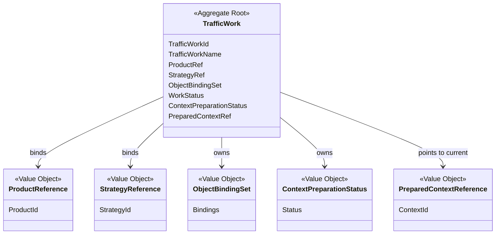
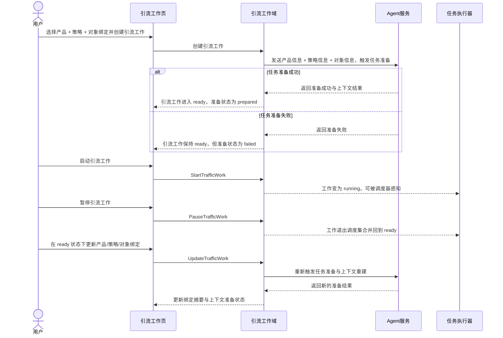

# Cybernomads 引流工作领域设计文档

## 1. 顶层共识与统一语言 (Ubiquitous Language)

### 1.1 模块职责边界 (Bounded Context)
- **包含**：定义“引流工作”这一稳定业务对象，并承载该工作所绑定的产品引用、策略引用和对象绑定集合。
- **包含**：管理引流工作的生命周期语义，例如创建、任务准备完成、启动、暂停、更新、结束、归档和删除。
- **包含**：管理引流工作与“任务准备结果”的关系，包括当前上下文是否已准备成功、是否可被调度器感知。
- **包含**：向前端和其他领域提供稳定的引流工作摘要、引流工作详情、绑定摘要和当前上下文准备状态语义。
- **不包含**：Agent 服务接入、连接校验、能力准备和 provider 适配细节。
- **不包含**：任务如何拆分、任务如何调度、subagent 如何执行、日志如何写入和平台脚本如何运行。
- **不包含**：产品正文内容管理、策略包编译逻辑、账号授权细节和对象资源本体管理。
- **不包含**：前端“工作区”视图命名、页面布局、按钮交互和提示文案等展示层设计。
- **不包含**：文件夹路径、脚本落盘方式、数据库表结构和对象绑定的具体存储格式等基础设施实现细节。

在 Cybernomads 当前阶段，引流工作域不是前端的“工作区页面”，也不是任务执行器本身。它更像一个长期存在的“增长作战单元”，负责回答这些核心问题：当前这份工作推广什么、用什么策略、绑定了哪些对象、是否已经准备好运行、是否正在运行，以及是否允许继续恢复或更新。

### 1.2 核心业务词汇表 (Glossary)
- **引流工作 (Traffic Work)**：由一个产品、一个策略和一组对象绑定共同组成的可长期运行业务对象。
- **引流工作标识 (Traffic Work Identifier)**：系统内部用于唯一识别某个引流工作的稳定标识。
- **引流工作名称 (Traffic Work Name)**：用户可读的工作名称，用于列表展示和辨认，不承担唯一性约束。
- **产品引用 (Product Reference)**：引流工作所绑定产品的稳定引用关系，当前以 `productId` 语义存在。
- **策略引用 (Strategy Reference)**：引流工作所绑定策略的稳定引用关系，当前以 `strategyId` 语义存在。
- **对象绑定集合 (Object Binding Set)**：为满足策略对象栏要求而绑定到引流工作上的对象集合，表达“这个工作实际使用了哪些资源对象”。
- **对象槽位 (Object Slot)**：策略中声明的某个待绑定对象位置，例如“账号A”“图片B”“素材C”。
- **绑定摘要 (Binding Summary)**：用于详情页展示的最小绑定信息集合，说明当前工作绑定了哪个产品、哪个策略以及哪些对象。
- **任务准备 (Task Preparation)**：系统把产品、策略和对象信息交给 Agent 服务后，由 Agent 完成任务拆分和执行上下文准备的过程。
- **工作上下文 (Work Context)**：某个引流工作当前供 Agent / subagent 执行时消费的上下文载体，语义上是运行快照，而不是单纯的页面配置。
- **上下文准备结果 (Context Preparation Result)**：任务准备阶段输出的结果语义，说明当前工作是否已经具备可运行上下文。
- **上下文准备状态 (Context Preparation Status)**：当前工作上下文准备所处的业务状态，例如 `pending`、`prepared`、`failed`。
- **工作状态 (Work Status)**：引流工作当前所处的主生命周期状态，例如 `ready`、`running`、`ended`、`archived`、`deleted`。
- **调度可见性 (Scheduler Visibility)**：某个引流工作是否会被任务执行器感知并参与后续扫描的业务语义。
- **更新重建 (Update And Rebuild)**：在不创建新引流工作对象的前提下，对现有工作重新绑定并重新触发任务准备的行为。
- **结束 (End Work)**：停止该工作继续运行，但保留其业务对象与历史查看语义。
- **归档 (Archive Work)**：将不再活跃的工作移出常规管理集合，但保留只读查看价值。
- **删除 (Delete Work)**：将该工作从常规业务集合中移除的终止性操作；其具体物理删除或逻辑删除方式不在本领域文档中定义。
- **工作区 (Workspace View)**：前端页面中的展示名称，不是独立领域对象。

## 2. 领域模型与聚合关系 (Domain Models & Aggregates)

引流工作域当前建议保持单聚合根设计：
- `TrafficWork` 是引流工作域的聚合根，负责表达“一个具体增长作战单元”的完整业务身份。
- `ProductReference` 是值对象，用于表达当前工作绑定的是哪一个产品；它表达引用关系，而不是产品快照正文。
- `StrategyReference` 是值对象，用于表达当前工作绑定的是哪一个策略；它表达引用关系，而不是策略编译结果本体。
- `ObjectBindingSet` 是值对象，用于表达当前工作为满足策略对象栏而形成的一组绑定关系；其底层是否使用 JSON map、关系表或其他格式，不属于领域模型关注点。
- `ContextPreparationStatus` 是值对象，用于表达当前任务准备阶段是否成功完成。
- `PreparedContextReference` 是值对象，用于表达当前工作所对应的运行上下文引用；它只表达“有一份可供执行的上下文”，不绑定具体文件系统路径语义。

在领域语义上，`TrafficWork` 的关键职责不是管理任务本身，而是保证：
- 元数据层面：引流工作稳定持有产品引用、策略引用和对象绑定。
- 运行层面：引流工作能够关联到一份由 Agent 服务准备出来的工作上下文。

因此，引流工作在配置层是“引用关系”，在执行层是“运行快照”。这两个语义必须同时存在，但不能混为一谈。

## 3. 核心业务约束 (Invariants & Business Rules)

- **单产品绑定约束**：一个引流工作必须且只绑定一个产品引用，不支持多产品并行绑定。
- **单策略绑定约束**：一个引流工作必须且只绑定一个策略引用，不支持多策略并行绑定。
- **对象满足约束**：一个引流工作必须提供策略对象栏所需的对象绑定集合；缺少必需对象时不得进入可运行准备流程。
- **名称非唯一约束**：引流工作名称只承担可读展示语义，不承担唯一性约束；稳定身份由 `TrafficWorkId` 承担。
- **引用存储约束**：引流工作在元数据层保存的是产品引用、策略引用和对象绑定结果，而不是产品和策略的完整正文副本。
- **快照执行约束**：引流工作一旦完成任务准备，后续执行实际消费的是该次准备生成的工作上下文，而不是实时重新读取最新产品/策略正文。
- **准备先于运行约束**：引流工作必须先完成一次任务准备，才能具备可启动前置条件。
- **准备失败隔离约束**：当任务准备失败时，引流工作主状态仍可停留在 `ready`，但其 `ContextPreparationStatus` 必须显式标记为 `failed`，且该工作不得进入启动流程。
- **调度可见性约束**：只有处于 `running` 状态的引流工作，才允许被任务执行器感知；`ready`、`ended`、`archived`、`deleted` 状态均不得进入调度扫描集合。
- **暂停回退约束**：暂停不是一个独立长期主状态；在当前 MVP 语义下，暂停动作会让引流工作从 `running` 回到 `ready`，并退出调度可见集合。
- **更新前置约束**：运行中的引流工作不得被直接更新；用户必须先让其退出运行状态，再触发更新重建。
- **更新保身份约束**：更新重建不会创建新的引流工作对象，也不会更换 `TrafficWorkId`；它是在原业务对象上重新绑定并重新准备上下文。
- **更新重准备约束**：更新后必须重新通知 Agent 服务进行任务拆分和上下文准备；更新不是纯元数据修改。
- **原位重建约束**：更新重建复用原引流工作的上下文归属，不创建新的引流工作身份；至于底层文件夹如何改写，属于实现设计。
- **无限运行约束**：引流工作默认是长期运行对象，只要未被暂停、结束、归档或删除，且其下存在可执行任务，就应持续参与执行器扫描。
- **结束终止约束**：引流工作一旦结束，不再进入调度集合；是否允许后续转归档，由上层业务决定。
- **归档只读约束**：归档后的引流工作退出常规活跃集合，但保留查看摘要、详情和历史绑定语义。
- **删除终止约束**：删除后的引流工作不得再被启动、恢复或调度；其底层是否物理删除，不属于本领域文档约束范围。
- **视图解耦约束**：前端“工作区”只是展示视图名称，不等于领域对象；领域中真实存在的是 `TrafficWork`。
- **最小化约束**：引流工作域当前不引入任务调度算法、日志明细结构、平台动作脚本、Agent provider 细节和前端页面交互文案等高变动实现概念。

## 4. 核心用例与行为流转 (Core Behaviors)

### 4.1 用户故事 (User Stories)
- **用户故事 1**：作为用户，我希望创建一个引流工作，并在创建时选择一个产品、一个策略以及该策略所需的对象绑定，以便系统形成一个真实可运行的增长作战单元。
  - **验收标准 (AC)**：创建成功后，系统中存在一个由稳定 `TrafficWorkId` 标识的引流工作对象，且该对象能返回产品引用、策略引用、对象绑定集合和当前上下文准备状态。

- **用户故事 2**：作为用户，我希望在引流工作详情中查看当前绑定摘要和当前上下文准备状态，以便确认这份工作到底推广什么、绑定了什么、是否已经准备好运行。
  - **验收标准 (AC)**：引流工作详情至少稳定展示工作名称、产品摘要、策略摘要、对象绑定摘要和上下文准备状态。

- **用户故事 3**：作为系统，我希望在引流工作创建后，把产品信息、策略信息和对象信息交给 Agent 服务完成任务拆分与上下文准备，以便让这份工作进入可启动前置状态。
  - **验收标准 (AC)**：当 Agent 服务成功完成任务准备后，该引流工作的主状态为 `ready`，上下文准备状态为 `prepared`，但在启动前不被任务执行器感知。

- **用户故事 4**：作为用户，我希望启动一份已经准备好的引流工作，以便该工作进入运行态并开始被任务执行器持续扫描。
  - **验收标准 (AC)**：只有当引流工作处于 `ready` 且上下文准备状态为 `prepared` 时，系统才允许其切换为 `running`，并进入调度可见集合。

- **用户故事 5**：作为用户，我希望暂停一份正在运行的引流工作，以便它停止继续被执行器感知，但保留后续恢复或更新的可能性。
  - **验收标准 (AC)**：暂停后，引流工作退出调度可见集合，主状态回到 `ready`，且现有绑定关系仍可被查看。

- **用户故事 6**：作为用户，我希望在引流工作暂停后对其进行更新，以便在不创建新工作对象的前提下重新绑定并重新触发任务准备。
  - **验收标准 (AC)**：更新不会生成新的 `TrafficWorkId`，但会重新触发 Agent 服务完成任务拆分和上下文准备，并更新当前上下文准备状态。

- **用户故事 7**：作为用户，我希望结束、归档或删除一个不再需要继续运行的引流工作，以便系统区分“停止运行”“移出活跃管理”和“终止移除”三种不同语义。
  - **验收标准 (AC)**：结束、归档和删除后的引流工作均不得继续被任务执行器感知，但仍按各自语义保留相应查看或管理边界。

### 4.2 核心领域事件/命令 (Commands & Events)
- **命令 (Command)**：`CreateTrafficWorkCommand`（创建引流工作）
- **命令 (Command)**：`PrepareTrafficWorkContextCommand`（准备引流工作上下文）
- **命令 (Command)**：`StartTrafficWorkCommand`（启动引流工作）
- **命令 (Command)**：`PauseTrafficWorkCommand`（暂停引流工作）
- **命令 (Command)**：`UpdateTrafficWorkCommand`（更新引流工作）
- **命令 (Command)**：`EndTrafficWorkCommand`（结束引流工作）
- **命令 (Command)**：`ArchiveTrafficWorkCommand`（归档引流工作）
- **命令 (Command)**：`DeleteTrafficWorkCommand`（删除引流工作）
- **命令 (Command)**：`GetTrafficWorkSummaryCommand`（获取引流工作摘要）
- **命令 (Command)**：`GetTrafficWorkDetailCommand`（获取引流工作详情）
- **事件 (Event)**：`TrafficWorkCreatedEvent`（引流工作已创建）
- **事件 (Event)**：`TrafficWorkPreparationSucceededEvent`（引流工作上下文准备成功）
- **事件 (Event)**：`TrafficWorkPreparationFailedEvent`（引流工作上下文准备失败）
- **事件 (Event)**：`TrafficWorkStartedEvent`（引流工作已启动）
- **事件 (Event)**：`TrafficWorkPausedEvent`（引流工作已暂停）
- **事件 (Event)**：`TrafficWorkUpdatedEvent`（引流工作已更新）
- **事件 (Event)**：`TrafficWorkEndedEvent`（引流工作已结束）
- **事件 (Event)**：`TrafficWorkArchivedEvent`（引流工作已归档）
- **事件 (Event)**：`TrafficWorkDeletedEvent`（引流工作已删除）

### 4.3 核心业务流图 (Behavior Flow)

这条核心行为流表达的是引流工作域最重要的业务闭环：
- 引流工作在创建后不会立刻运行，而是先进入一次任务准备过程。
- 引流工作只有在 `running` 状态时才对任务执行器可见。
- 暂停动作让工作退出调度集合并回到 `ready`，从而为恢复或更新提供入口。
- 更新不是创建新工作，而是对原工作执行一次重新绑定和重新准备。

在这个闭环中，引流工作域只负责“定义和维护可运行工作对象本身、其绑定关系、生命周期和上下文准备状态”，不负责“如何调度任务”“如何执行平台动作”或“如何记录日志明细”。

## 5. 工作上下文补充（2026-04-25）

为避免引流工作领域与任务领域混淆，这里补充当前“工作上下文”的领域语义边界：

- 引流工作在创建或更新时，会先获得一份稳定的工作上下文归属。
- 这份工作上下文由系统预先铺设最小骨架目录：`skills/`、`tools/`、`knowledge/`、`data/`。
- 这些目录表达的是“该工作可被 Agent 消费的上下文空间”，而不是任务领域本身。
- 任务文档不是引流工作域预置的固定占位物，系统不再预写统一 `task.md`。
- 任务文档与补充资产由 Agent 在任务拆分阶段写入该工作上下文，因此它们属于“工作准备结果”，不是“工作身份本体”。
- 引流工作更新时沿用原有工作上下文归属，不创建新的工作目录身份；这体现的是“同一工作对象的原位重建”。
- 是否存在若干 `task-*.md`、任务文档如何命名、任务文档写入了什么内容，这些都属于任务拆分实现细节，不在本领域文档中展开。

基于上述边界，可以把当前引流工作域理解为：
- 它负责回答“这份工作是否已经拥有可运行的上下文空间”。
- 它不负责回答“具体拆成了几个任务、每个任务如何执行、任务文件内部写了什么”。
