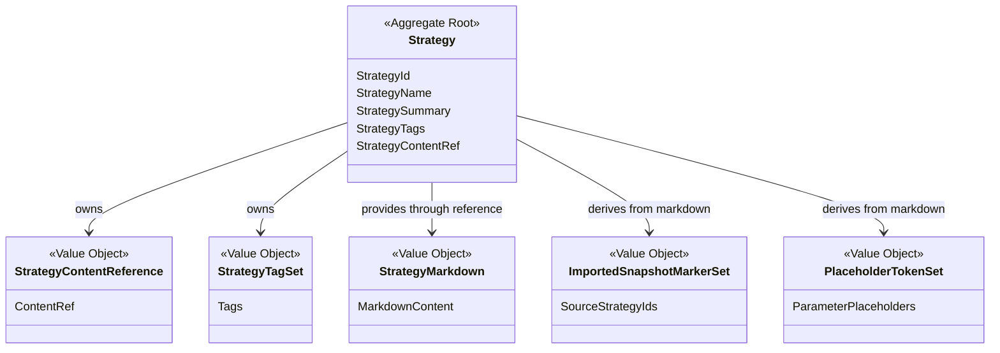
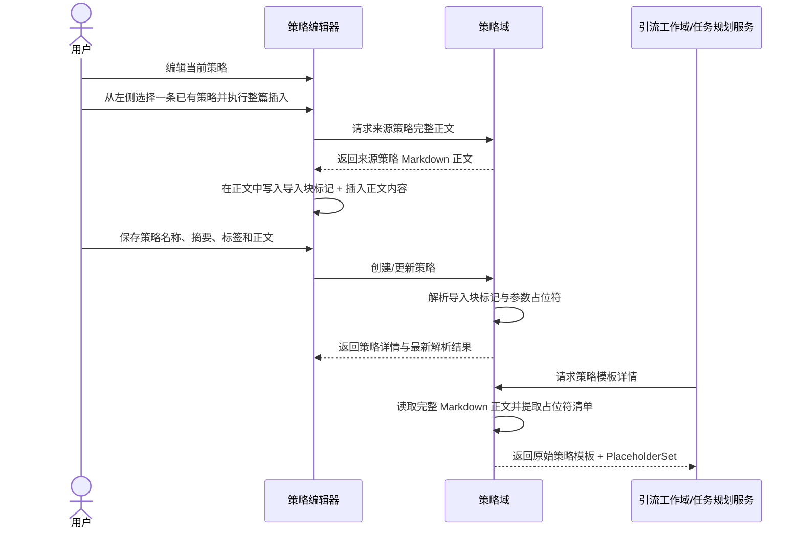

# Cybernomads 策略领域设计文档

## 1. 顶层共识与统一语言 (Ubiquitous Language)

### 1.1 模块职责边界 (Bounded Context)

- **包含**：定义策略这一稳定业务对象，并承载可供 AI 消费的完整 Markdown 策略正文。
- **包含**：管理策略的最小业务属性，例如策略标识、策略名称、策略摘要、策略标签和正文引用关系。
- **包含**：支持在策略编辑过程中将已有策略正文以“整篇快照插入”的方式组合进当前策略，但不形成策略之间的活引用关系。
- **包含**：识别策略正文中的参数占位符与导入块标记，并向上层提供稳定的策略模板输入。
- **包含**：向引流工作域、任务规划服务或后续填写流程提供完整策略正文、参数声明清单和原始 Markdown 模板。
- **不包含**：账号、素材、产品等真实对象的绑定路由与解析，不负责把占位符映射到具体资源实例。
- **不包含**：任务如何拆分、引流工作如何创建、运行时如何调度、执行日志如何回写。
- **不包含**：前端拖拽交互、页面布局或视觉风格本身等界面实现细节；但会约束正文内对象引用标记的稳定文本契约。
- **不包含**：策略实验、A/B 对照、版本链、草稿/发布状态机、策略运行效果统计等超出 MVP 的复杂能力。
- **不包含**：数据库表结构、文件路径拼接、SQLite 与文件系统适配细节等基础设施设计。

在 Cybernomads 的当前阶段，策略域不是一个复杂的流程编排器，也不是一个策略关系图数据库。它更像一个稳定的“策略提示词资产中心”，负责回答三个核心问题：当前有哪些可被选择的策略资产、某条策略的完整 Markdown 正文是什么、这份正文中声明了哪些可供后续填写的参数占位符。

### 1.2 核心业务词汇表 (Glossary)

- **策略 (Strategy)**：系统中的一个独立业务对象，本质上是一份可被 AI 消费的 Markdown 策略文档。
- **策略标识 (Strategy Identifier)**：系统内部用于唯一识别某条策略的稳定标识。
- **策略名称 (Strategy Name)**：用于列表展示、人工识别和选择策略的可读名称，不承担唯一性约束。
- **策略摘要 (Strategy Summary)**：用于列表展示和快速选择的最小摘要信息，不等同于完整正文。
- **策略标签 (Strategy Tags)**：用于分类、筛选和快速识别的标签集合，不承担组合语义。
- **策略正文 (Strategy Markdown Content)**：策略的完整 Markdown 原文，是 AI 理解策略意图的核心输入。
- **策略正文引用 (Strategy Content Reference)**：策略对象与其 Markdown 正文之间的稳定关联关系。
- **整篇快照插入 (Snapshot Insertion)**：在编辑某条策略时，把另一条策略的完整正文拷贝进当前正文的行为。插入后两者完全解耦，不形成活引用。
- **导入块标记 (Imported Snapshot Marker)**：嵌入在 Markdown 正文中的特殊注释标记，用于标识“这一整块内容最初来自哪条策略”。当前推荐短契约 `<!-- s:strategyId -->` 与 `<!-- /s -->`；历史长契约 `<!-- cn-strategy-import:start source-id="..." -->` 与对应结束标记继续兼容读取。
- **来源策略 (Source Strategy)**：被作为整篇快照插入来源的原始策略对象，仅承担编辑辅助语义，不承担运行时依赖语义。
- **对象引用占位符 (Object Reference Placeholder Token)**：在策略正文中声明后续需要填写的位置标记，当前统一采用 `{{type:name="value"}}` 语法，例如 `{{账号:对象1=""}}`、`{{时间:发布时间="18:30"}}`。
- **对象类型 (Object Reference Type)**：占位符左侧的类型标识，用于表达“这是什么类别的对象或字段”，例如 `账号`、`时间`、`产品`。当前不限制为固定枚举。
- **对象名称 (Object Reference Name)**：占位符中的稳定字段名，用于表达“这一处具体要填写哪个对象槽位”，例如 `对象1`、`对象2`、`发布时间`。
- **对象默认值 (Object Reference Default Value)**：占位符中声明的默认值，当前统一为字符串；允许为空字符串。
- **策略模板输入 (Strategy Template Input)**：策略域对外提供的完整 Markdown 模板，由上层自行决定是否进行参数收集与最终填充。
- **占位符清单 (Placeholder Set)**：从策略正文中解析出的参数占位符声明集合，供上层填写流程使用。

## 2. 领域模型与聚合关系 (Domain Models & Aggregates)



策略域当前建议保持单聚合根设计：

- `Strategy` 是策略域的聚合根，负责表达“一个可被识别、可被维护、可被 AI 消费的 Markdown 策略资产”。
- `StrategyContentReference` 是值对象，用于表达策略与其完整正文内容之间的稳定关联。
- `StrategyTagSet` 是值对象，用于表达标签集合这一可整体替换的分类语义。
- `StrategyMarkdown` 是值对象，承载完整 Markdown 正文，是策略语义的核心载体。
- `ImportedSnapshotMarkerSet` 是从正文中派生出的值对象，用于表达当前正文里哪些内容块最初来源于其他策略，但这些来源信息只服务编辑识别，不形成跨策略依赖。
- `PlaceholderTokenSet` 是从正文中派生出的值对象，用于表达当前策略声明了哪些待填写参数。

在领域语义上，`Strategy` 的核心职责不是维护复杂引用图，而是保证“一条策略始终对应一份完整、独立、可解析的 Markdown 正文”，并且能够从这份正文中稳定提取编辑辅助标记与参数声明。

## 3. 核心业务约束 (Invariants & Business Rules)

- **独立资产约束**：每条策略在领域语义上都是一个独立对象，不因被其他策略整篇插入而形成从属关系或活引用关系。
- **单正文约束**：在当前 MVP 设计下，一条策略只关联一份有效 Markdown 正文，不引入多正文并存或正文版本链。
- **快照插入约束**：将已有策略插入当前策略时，语义上是正文内容拷贝，而不是建立跨策略引用；来源策略后续修改不会自动影响已插入内容。
- **来源标记保留约束**：快照插入后形成的导入块标记可以保留在正文中，用于后续编辑识别；即使插入块被人工改写，其来源标记仍可继续存在。
- **来源标记非运行依赖约束**：导入块标记只承担编辑辅助语义，不得被解释为运行时引用、同步依赖或编译前置条件。
- **整篇插入约束**：当前阶段只支持“整篇策略插入”，不支持按段落、按章节或按局部片段建立组合关系。
- **模板透传约束**：策略域对外提供的是完整 Markdown 模板与参数声明，不负责运行时填值或最终字符串编译。
- **占位符语法约束**：对象引用占位符必须使用稳定、可解析的统一语法 `{{type:name="value"}}`。
- **类型开放约束**：占位符中的 `type` 当前为开放字符串，只要满足统一分隔与转义规则即可，不限制为固定枚举。
- **默认值必填约束**：每个对象引用占位符都必须声明默认值，且当前统一使用字符串字面量；允许空字符串。
- **实例独立约束**：同一条策略正文中允许出现多个同类型、同默认值的对象引用实例；编辑语义应按正文中的具体实例生效，而不是把同类型对象隐式视为同一个运行时槽位。
- **绑定解耦约束**：策略域只负责识别和暴露对象引用声明，不负责将其绑定到具体账号、素材或产品实例。
- **列表摘要约束**：策略列表视图只返回摘要信息，不要求为每一条策略返回完整 Markdown 正文；摘要可以独立维护，也可以在缺省时由正文派生。
- **名称非唯一约束**：策略名称只承担可读展示语义，不承担唯一性约束；系统唯一识别依赖稳定策略标识。
- **短标识约束**：当前阶段系统生成的新策略标识推荐使用固定长度短标识，默认采用 8 位十六进制字符串，以兼顾可读性、复制成本和本地 SQLite 场景下的稳定性。
- **最小化约束**：当前阶段不引入草稿、发布、归档、实验、评分、成功率、难度等级或运行统计等非核心业务语义。
- **可读性约束**：一条可被使用的策略必须至少具备有效策略名称和可读取的完整正文。
- **上下文完整性约束**：当上层请求策略详情或完整策略输入时，策略域提供的应是完整正文或去辅助标记后的完整策略模板，而不是仅返回名称、标签或片段摘要。

## 4. 核心用例与行为流转 (Core Behaviors)

### 4.1 用户故事 (User Stories)

- **用户故事 1**：作为用户，我希望创建一条策略并编写完整 Markdown 正文，以便系统能够保存一份可供 AI 理解和后续执行消费的策略资产。
  - **验收标准 (AC)**：创建成功后，系统中存在一个由稳定策略标识识别的策略对象，且该策略能够返回完整 Markdown 正文。

- **用户故事 2**：作为用户，我希望在策略列表中看到各条策略的名称、摘要和标签等最小信息，以便我快速识别并选择合适的策略。
  - **验收标准 (AC)**：策略列表返回结果不依赖完整正文，也足以支撑选择与管理场景。

- **用户故事 3**：作为用户，我希望在编辑某条策略时，把已有策略整篇插入到当前正文中，以便我快速复用已有提示词内容，而不需要手工重复编写。
  - **验收标准 (AC)**：插入完成后，当前策略正文中包含来源策略的完整内容与可识别的导入块标记；后续来源策略修改不会自动影响当前策略。

- **用户故事 4**：作为用户，我希望在策略正文中声明参数占位符，以便后续流程能够根据统一契约收集字段值并填充到模板中。
  - **验收标准 (AC)**：系统能够稳定识别 `{{账号:对象1=""}}`、`{{账号:对象2=""}}` 或 `{{时间:发布时间="18:30"}}` 形式的占位符，并在查询时提供占位符清单。

- **用户故事 5**：作为上层引流工作或任务规划使用方，我希望获取一份完整策略模板和参数声明清单，以便后续流程基于统一契约继续执行填写和消费。
  - **验收标准 (AC)**：当系统请求策略详情时，返回内容保留完整正文语义和占位符声明；运行时是否填值由上层自行决定。

- **用户故事 6**：作为用户，我希望更新已有策略的名称、摘要、标签或正文内容，以便策略资产能够随着我的增长方法迭代而保持最新。
  - **验收标准 (AC)**：更新成功后，系统对外暴露的策略元数据、正文内容和占位符解析结果均为最新状态。

### 4.2 核心领域事件/命令 (Commands & Events)

- **命令 (Command)**：`CreateStrategyCommand`（创建策略）
- **命令 (Command)**：`UpdateStrategyCommand`（更新策略）
- **命令 (Command)**：`ListStrategySummaryCommand`（获取策略摘要列表）
- **命令 (Command)**：`GetStrategyDetailCommand`（获取策略详情）
- **命令 (Command)**：`InsertStrategySnapshotCommand`（整篇插入来源策略快照）
- **命令 (Command)**：`ExtractStrategyPlaceholdersCommand`（提取策略占位符清单）
- **事件 (Event)**：`StrategyCreatedEvent`（策略已创建）
- **事件 (Event)**：`StrategyUpdatedEvent`（策略已更新）
- **事件 (Event)**：`StrategySnapshotInsertedEvent`（策略快照已插入）
- **事件 (Event)**：`StrategyPlaceholdersExtractedEvent`（策略占位符清单已提取）

### 4.3 核心业务流图 (Behavior Flow)



这条核心行为流表达的是策略域当前最重要的稳定闭环：

- 用户可以把其他策略整篇插入当前策略，但插入的本质是内容快照，而不是跨策略依赖。
- 编辑器中的导入块标记会随着正文一起保存，从而支持后续继续识别来源区块。
- 当上层消费策略时，策略域负责输出原始 Markdown 模板与参数声明清单，后续是否填值、如何填值由其它模块自行决定。

在这个闭环中，策略域只负责“定义、维护、识别和提供策略提示词资产”，不负责“这些对象最终绑定到谁”、"任务如何被拆出来"或“AI 在运行时如何执行这些策略”。

## 5. 当前实现补充说明 (Implementation Notes)

### 5.1 策略标识生成约定

- 当前实现中新创建的策略默认生成 8 位十六进制短标识，例如 `bzflow01` 属于人工示例 ID，运行时自动生成值则类似 `a1b2c3d4`。
- 历史上已存在的长 UUID 形式策略标识继续兼容读取、更新和被导入块识别；系统不要求一次性迁移历史数据。
- 前端展示层可以只展示短标识，但路由、接口与 SQLite 主键语义仍以完整 `strategyId` 为准。

### 5.2 导入块正文契约

- 当前推荐写法：

```md
<!-- s:bvscan01 -->
...被整篇插入的小策略正文...
<!-- /s -->
```

- 选择短契约的原因：
  - 减少进入提示词后的无关噪音。
  - 降低 Agent 在阅读长注释标记时产生误判或幻觉的概率。
  - 继续保留“该区域来源于哪条策略”的可追踪信息。

- 历史长契约仍需兼容读取，但新插入内容应统一使用短契约。

### 5.3 示例策略数据边界

- 当前放入运行时目录和 SQLite 的示例策略，只是本地运行时示例数据，用于联调、前端渲染验证和工作区演示。
- 这些示例策略不等同于“项目首次初始化自动导入的官方种子数据”。
- 若需要让团队成员首次启动项目后自动拿到同一批基础策略，应额外建设受版本控制的 seed 目录和启动初始化导入流程。

### 5.4 当前对象引用编辑契约补充

- 前端编辑器中的对象引用高亮块，本质上仍然对应正文里的 `{{type:name="value"}}` 原始文本；高亮渲染只是一层可视化包装，不改变底层 Markdown 契约。
- 同一 `type` 在展示层应复用同一颜色语义，不同 `type` 采用不同颜色，以帮助用户快速区分对象类别。
- 对象引用左侧图标当前推荐直接使用 `type` 的首字符，而不是额外引入独立图标枚举。
- 编辑器新增对象引用时，默认应按 `对象1`、`对象2`、`对象3` 递增生成名称，以避免在前端默认值层引入业务含义过重的示例命名。
- 右侧对象引用列表与正文高亮块都应按正文中的实际对象实例工作；修改一个实例时，不应隐式联动同类型的其他实例。
