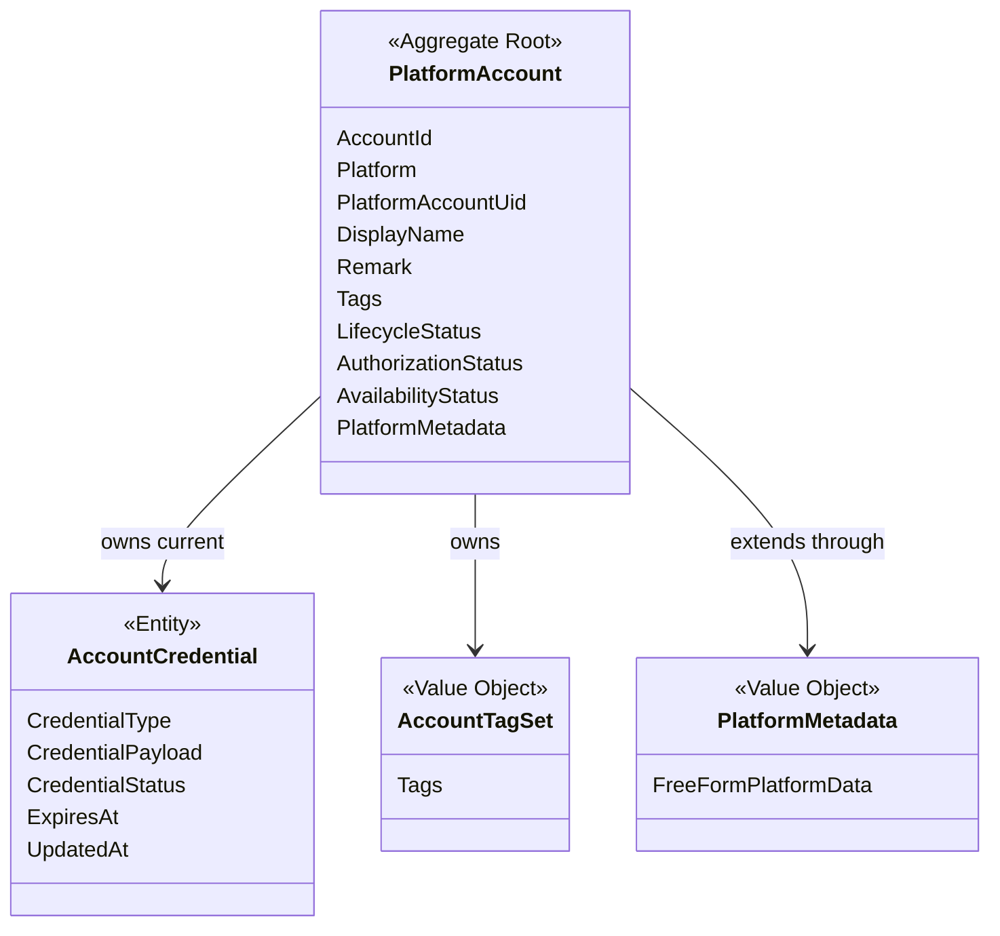
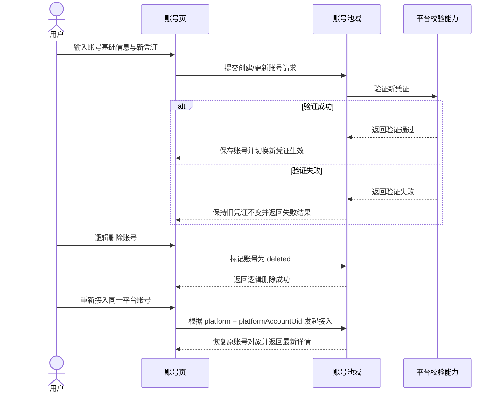

# Cybernomads 账号池领域设计文档

## 1. 顶层共识与统一语言 (Ubiquitous Language)

### 1.1 模块职责边界 (Bounded Context)
- **包含**：定义平台账号这一稳定业务对象，并承载账号的身份信息、平台归属、当前生效凭证和状态信息。
- **包含**：管理账号池中的最小业务属性，例如账号标识、平台账号唯一标识、显示名、备注、标签和平台扩展字段。
- **包含**：管理账号的生命周期状态、授权状态和可用状态，并向其他领域提供稳定的账号摘要与账号详情语义。
- **包含**：对外提供当前账号的可用凭证语义，供后续受信任的应用服务或其他领域消费。
- **不包含**：Agent 节点接入、平台脚本实现、二维码临时票据协议、凭证加密细节和底层存储格式设计。
- **不包含**：策略中的角色映射、对象绑定关系、工作区编排、任务调度和执行日志。
- **不包含**：品牌人格、语气系统、线索管理、平台运营策略和观测终端日志明细。

在 Cybernomads 的当前阶段，账号池域不是一个 CRM，也不是一个平台适配器集合。它更像一个稳定的“执行账号资源中心”，负责回答系统两个核心问题：当前有哪些可被识别和管理的平台账号，以及这些账号当前是否具备可被安全使用的凭证与状态。

### 1.2 核心业务词汇表 (Glossary)
- **账号池 (Account Pool)**：系统中统一管理平台账号资源的业务模块，用于沉淀可被后续流程消费的账号对象。
- **平台账号 (Platform Account)**：用户在某个平台上的一个真实账号对象，是账号池域的聚合根。
- **账号标识 (Account Identifier)**：系统内部用于唯一识别某个账号对象的稳定标识。
- **平台类型 (Platform Type)**：账号所属的平台类别，例如 Bilibili、Xiaohongshu、Douyin、Twitter。
- **平台账号唯一标识 (Platform Account UID)**：平台侧可稳定识别账号身份的唯一标识，在同一平台下承担唯一身份语义。
- **账号显示名 (Display Name)**：用于列表展示、详情识别和用户辨认的可读名称，不承担唯一约束。
- **账号备注 (Account Remark)**：用户为账号补充的人类可读说明，例如“主控运营号”“备用互动号”。
- **账号标签 (Account Tags)**：用户为账号添加的运营分类标记，用于列表筛选和快速识别，不等同于人格系统。
- **凭证实体 (Account Credential)**：从属于某个平台账号的当前生效凭证实体，承载凭证类型、凭证数据和凭证状态等信息。
- **凭证类型 (Credential Type)**：当前账号所采用的凭证获取或承载方式，例如 `token`、`cookie`、`session`、`qr_authorization`。
- **生命周期状态 (Lifecycle Status)**：账号对象在系统内部的存续状态，例如 `active`、`disabled`、`deleted`。
- **授权状态 (Authorization Status)**：账号与目标平台之间的授权关系状态，例如 `unauthorized`、`authorizing`、`authorized`、`expired`、`revoked`。
- **可用状态 (Availability Status)**：账号当前是否适合继续被系统使用的运行判断，例如 `unknown`、`healthy`、`risk`、`restricted`、`offline`。
- **平台扩展字段 (Platform Metadata)**：用于承载平台独有补充信息的自由扩展字段，不得反向替代核心通用属性。
- **账号摘要信息 (Account Summary)**：用于列表展示和快速选择的最小账号信息集合，通常不包含完整凭证内容。
- **账号详情信息 (Account Detail)**：用于查看和管理单个账号的完整信息集合，包含核心身份信息、状态信息、当前凭证语义和平台扩展字段。

## 2. 领域模型与聚合关系 (Domain Models & Aggregates)

账号池域当前建议保持单聚合根设计：
- `PlatformAccount` 是账号池域的聚合根，负责表达“一个稳定存在、可被识别、可被配置、可被后续流程消费的平台账号对象”。
- `AccountCredential` 是聚合内实体，用于表达某个账号当前正在生效的那一套凭证。它从属于账号对象，不单独作为独立聚合存在。
- `AccountTagSet` 是值对象，用于表达标签集合这一可整体替换的业务语义。
- `PlatformMetadata` 是值对象，用于承载平台独有补充信息，并隔离多平台差异对核心模型的污染。

在领域语义上，`PlatformAccount` 的职责不是承担平台协议实现，也不是承担策略绑定角色。它的核心职责是保证“同一个平台账号在系统中始终是一个稳定对象，并且能够携带一套当前可被理解和管理的凭证与状态语义”。

## 3. 核心业务约束 (Invariants & Business Rules)

- **唯一身份约束**：同一平台下，`platform + platformAccountUid` 在全生命周期内只能对应一个账号对象，不允许生成多个语义重复的聚合根。
- **恢复优先约束**：若某个账号已被逻辑删除，后续再次以相同 `platform + platformAccountUid` 接入时，应恢复原账号对象，而不是创建新的重复账号。
- **对象独立约束**：凭证失效、授权过期、平台校验失败或暂时离线，都不能导致账号对象失去可读取性或被视为不存在。
- **显示名非唯一约束**：账号显示名只承担可读展示语义，不承担唯一性约束。
- **单当前凭证约束**：在当前阶段，一个账号只允许存在一套当前生效凭证，不引入并行多凭证、凭证历史版本链或多生效态并存语义。
- **凭证从属约束**：当前生效凭证必须从属于 `PlatformAccount` 聚合，不允许脱离账号对象单独被业务层作为独立根对象消费。
- **验证后切换约束**：当用户提交新的凭证内容时，只有在验证成功后，新凭证才允许替换当前生效凭证；验证失败时，旧凭证必须保持不变。
- **状态解耦约束**：生命周期状态、授权状态和可用状态是三个相互独立的状态维度，禁止将它们压缩为单一字段或彼此覆盖。
- **逻辑删除约束**：当前阶段账号域只支持逻辑删除，不支持物理删除；被逻辑删除的账号对象仍保留其身份语义和恢复可能性。
- **平台扩展隔离约束**：平台独有补充信息只能进入 `platformMetadata`，不得替代或污染账号的核心通用字段。
- **查询退化约束**：即使外部平台暂时不可达，系统也必须能够基于最近一次稳定存储返回账号摘要与账号详情，而不是把实时探测结果当作读取前置条件。
- **最小化约束**：账号域当前不引入品牌人格、语气系统、对象绑定角色、执行日志明细、线索档案和复杂平台运营语义。

## 4. 核心用例与行为流转 (Core Behaviors)

### 4.1 用户故事 (User Stories)
- **用户故事 1**：作为用户，我希望新增一个平台账号并录入其基础信息与当前凭证，以便系统能够管理一个稳定可识别的账号对象。
  - **验收标准 (AC)**：创建成功后，系统中存在一个由稳定账号标识识别的平台账号对象，且该对象可被后续查询。

- **用户故事 2**：作为用户，我希望在账号列表中查看已有账号的摘要信息与状态，以便我快速识别当前账号池中的资源情况。
  - **验收标准 (AC)**：账号列表至少稳定展示平台、显示名、平台账号唯一标识、标签和关键状态摘要。

- **用户故事 3**：作为用户，我希望更新某个账号的备注、标签或当前凭证，以便该账号能够持续保持最新配置。
  - **验收标准 (AC)**：更新成功后，账号详情返回的基础信息、状态信息和当前凭证语义均为最新内容。

- **用户故事 4**：作为系统中的受信任调用方，我希望通过账号模块获取某个账号当前可用的凭证语义，以便后续流程能够基于该账号继续执行。
  - **验收标准 (AC)**：当账号具备有效当前凭证时，账号模块能够稳定返回该账号的当前生效凭证信息。

- **用户故事 5**：作为用户，我希望逻辑删除一个暂时不再使用的账号，但保留其后续恢复可能性，以便系统不丢失该账号的稳定身份。
  - **验收标准 (AC)**：逻辑删除后账号不再作为活跃账号参与常规管理，但再次接入相同平台账号时能够恢复原对象而非新建重复对象。

### 4.2 核心领域事件/命令 (Commands & Events)
- **命令 (Command)**：`CreatePlatformAccountCommand`（创建平台账号）
- **命令 (Command)**：`UpdatePlatformAccountProfileCommand`（更新账号基础资料）
- **命令 (Command)**：`ReplaceAccountCredentialCommand`（替换当前凭证）
- **命令 (Command)**：`VerifyAccountCredentialCommand`（验证账号凭证）
- **命令 (Command)**：`GetAccountSummaryCommand`（获取账号摘要信息）
- **命令 (Command)**：`GetAccountDetailCommand`（获取账号详情信息）
- **命令 (Command)**：`SoftDeletePlatformAccountCommand`（逻辑删除账号）
- **命令 (Command)**：`RestorePlatformAccountCommand`（恢复账号）
- **事件 (Event)**：`PlatformAccountCreatedEvent`（平台账号已创建）
- **事件 (Event)**：`PlatformAccountProfileUpdatedEvent`（账号资料已更新）
- **事件 (Event)**：`AccountCredentialVerifiedEvent`（账号凭证验证通过）
- **事件 (Event)**：`AccountCredentialRejectedEvent`（账号凭证验证失败）
- **事件 (Event)**：`PlatformAccountSoftDeletedEvent`（账号已逻辑删除）
- **事件 (Event)**：`PlatformAccountRestoredEvent`（账号已恢复）

### 4.3 核心业务流图 (Behavior Flow)

这条核心行为流表达的是账号池域最重要的稳定性闭环：
- 用户可以创建或更新账号，但新凭证必须在验证通过后才会正式生效。
- 用户可以逻辑删除账号，但账号对象不会从系统中被物理抹除。
- 当同一平台账号重新接入时，系统恢复原对象而不是制造新的重复对象。

在这个闭环中，账号池域只负责“定义和维护稳定的账号对象、状态语义与当前凭证”，不负责“如何执行平台动作”、"该账号在策略中扮演什么角色"或“平台日志如何观测与回放”。
