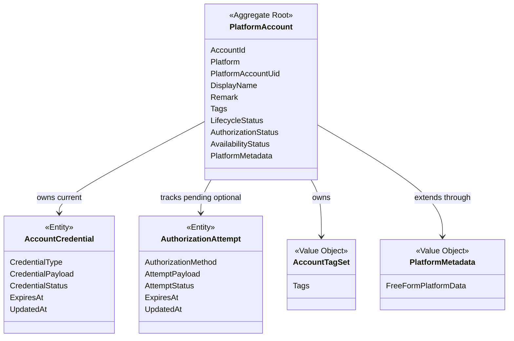
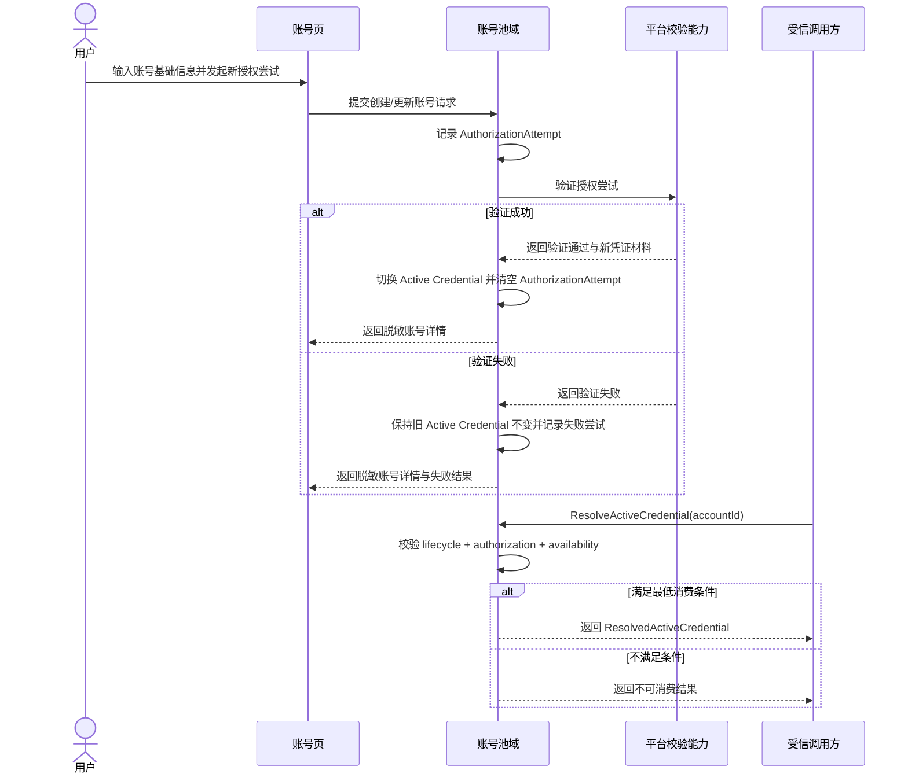

# Cybernomads 账号池领域设计文档

## 1. 顶层共识与统一语言 (Ubiquitous Language)

### 1.1 模块职责边界 (Bounded Context)
- **包含**：定义平台账号这一稳定业务对象，并承载账号的身份信息、平台归属、当前生效凭证、待验证授权尝试和状态信息。
- **包含**：管理账号池中的最小业务属性，例如账号标识、平台账号唯一标识、显示名、备注、标签和平台扩展字段。
- **包含**：管理账号的生命周期状态、授权状态和可用状态，并向其他领域提供稳定的账号摘要与脱敏账号详情语义。
- **包含**：对外提供受控的当前生效凭证解析能力，供后续受信任的应用服务或其他领域消费。
- **不包含**：Agent 节点接入、平台脚本实现、二维码临时票据协议、凭证加密细节和底层存储格式设计。
- **不包含**：策略中的角色映射、对象绑定关系、工作区编排、任务调度和执行日志。
- **不包含**：品牌人格、语气系统、线索管理、平台运营策略和观测终端日志明细。

在 Cybernomads 的当前阶段，账号池域不是一个 CRM，也不是一个平台适配器集合。它更像一个稳定的“执行账号资源中心”，负责回答系统三个核心问题：当前有哪些可被识别和管理的平台账号，这些账号当前是否存在可被安全消费的生效凭证，以及是否存在一轮尚未完成但不应污染当前凭证的授权尝试。

### 1.2 核心业务词汇表 (Glossary)
- **账号池 (Account Pool)**：系统中统一管理平台账号资源的业务模块，用于沉淀可被后续流程消费的账号对象。
- **平台账号 (Platform Account)**：用户在某个平台上的一个真实账号对象，是账号池域的聚合根。
- **账号标识 (Account Identifier)**：系统内部用于唯一识别某个账号对象的稳定标识。
- **平台类型 (Platform Type)**：账号所属的平台类别，例如 Bilibili、Xiaohongshu、Douyin、Twitter。
- **平台账号唯一标识 (Platform Account UID)**：平台侧可稳定识别账号身份的唯一标识，在同一平台下承担唯一身份语义。
- **账号显示名 (Display Name)**：用于列表展示、详情识别和用户辨认的可读名称，不承担唯一约束。
- **账号备注 (Account Remark)**：用户为账号补充的人类可读说明，例如“主控运营号”“备用互动号”。
- **账号标签 (Account Tags)**：用户为账号添加的运营分类标记，用于列表筛选和快速识别，不等同于人格系统。
- **当前生效凭证 (Active Credential)**：某个平台账号当前真正处于生效状态、可被受控消费的那一套凭证。
- **凭证实体 (Account Credential)**：从属于某个平台账号的当前生效凭证实体，承载凭证类型、凭证数据和凭证状态等信息。
- **凭证类型 (Credential Type)**：当前生效凭证的承载方式，例如 `token`、`cookie`、`session`。
- **授权尝试 (Authorization Attempt)**：一轮待验证、待切换、尚未正式生效的授权过程产物，例如新 Token 提交、待验证 Cookie 或扫码授权过程。
- **授权方式 (Authorization Method)**：发起一轮授权尝试的方式，例如 `token_input`、`cookie_input`、`qr_authorization`。
- **生命周期状态 (Lifecycle Status)**：账号对象在系统内部的存续状态，例如 `active`、`disabled`、`deleted`。
- **授权状态 (Authorization Status)**：账号与目标平台之间的授权关系状态，例如 `unauthorized`、`authorizing`、`authorized`、`expired`、`revoked`。
- **可用状态 (Availability Status)**：账号当前是否适合继续被系统使用的运行判断，例如 `unknown`、`healthy`、`risk`、`restricted`、`offline`。
- **平台扩展字段 (Platform Metadata)**：用于承载平台独有补充信息的自由扩展字段，不得反向替代核心通用属性。
- **账号摘要信息 (Account Summary)**：用于列表展示和快速选择的最小账号信息集合，通常不包含完整凭证内容。
- **账号详情信息 (Account Detail)**：用于查看和管理单个账号的脱敏信息集合，包含核心身份信息、状态信息、授权尝试摘要和平台扩展字段，但不包含原始凭证数据。
- **生效凭证解析结果 (Resolved Active Credential)**：仅面向受信任调用方返回的受控凭证结果，用于系统内部后续执行，不等同于普通账号详情。

## 2. 领域模型与聚合关系 (Domain Models & Aggregates)

账号池域当前建议保持单聚合根设计：
- `PlatformAccount` 是账号池域的聚合根，负责表达“一个稳定存在、可被识别、可被配置、可被后续流程消费的平台账号对象”。
- `AccountCredential` 是聚合内实体，用于表达某个账号当前正在生效的那一套凭证。它从属于账号对象，不单独作为独立聚合存在。
- `AuthorizationAttempt` 是聚合内实体，用于表达一轮尚未正式生效的授权尝试。它可以来源于 Token 提交、Cookie 提交或扫码授权，但在验证成功前不等于当前生效凭证。
- `AccountTagSet` 是值对象，用于表达标签集合这一可整体替换的业务语义。
- `PlatformMetadata` 是值对象，用于承载平台独有补充信息，并隔离多平台差异对核心模型的污染。

在领域语义上，`PlatformAccount` 的职责不是承担平台协议实现，也不是承担策略绑定角色。它的核心职责是保证“同一个平台账号在系统中始终是一个稳定对象，并且能够同时管理一套当前生效凭证与一轮可能存在的待验证授权尝试，而不让两者语义混淆”。

## 3. 核心业务约束 (Invariants & Business Rules)

- **唯一身份约束**：同一平台下，`platform + platformAccountUid` 在全生命周期内只能对应一个账号对象，不允许生成多个语义重复的聚合根。
- **恢复优先约束**：若某个账号已被逻辑删除，后续再次以相同 `platform + platformAccountUid` 接入时，应恢复原账号对象，而不是创建新的重复账号。
- **对象独立约束**：凭证失效、授权过期、平台校验失败或暂时离线，都不能导致账号对象失去可读取性或被视为不存在。
- **显示名非唯一约束**：账号显示名只承担可读展示语义，不承担唯一性约束。
- **单当前凭证约束**：在当前阶段，一个账号只允许存在一套当前生效凭证，不引入并行多凭证、凭证历史版本链或多生效态并存语义。
- **待验证隔离约束**：待验证授权尝试不属于当前生效凭证；无论其来源是 Token、Cookie 还是扫码授权，都只能以 `AuthorizationAttempt` 语义存在，直到验证成功后才允许切换为当前生效凭证。
- **凭证从属约束**：当前生效凭证必须从属于 `PlatformAccount` 聚合，不允许脱离账号对象单独被业务层作为独立根对象消费。
- **验证后切换约束**：当用户提交新的凭证内容时，只有在验证成功后，新凭证才允许替换当前生效凭证；验证失败时，旧凭证必须保持不变。
- **详情脱敏约束**：`AccountDetail` 只承担人可读、可管理的脱敏详情语义，不允许直接暴露 `CredentialPayload` 或其他可被直接消费的原始凭证数据。
- **受控解析约束**：当前生效凭证只能通过受控的 `ResolveActiveCredential` 用例对受信任调用方返回，不允许由普通账号详情查询直接承载。
- **状态解耦约束**：生命周期状态、授权状态和可用状态是三个相互独立的状态维度，禁止将它们压缩为单一字段或彼此覆盖。
- **生命周期主导约束**：当 `lifecycleStatus` 为 `deleted` 或 `disabled` 时，账号仍可被查询，但不得进入默认可消费集合，也不得被解析为可执行凭证资源。
- **授权前置约束**：只有当 `authorizationStatus` 为 `authorized` 时，账号才允许进入生效凭证解析流程；`unauthorized`、`authorizing`、`expired`、`revoked` 均不得被视为可直接消费状态。
- **可用性消费约束**：只有当 `availabilityStatus` 为 `healthy` 时，账号才应被视为默认可执行资源；`unknown`、`risk`、`restricted`、`offline` 可保留展示语义，但默认不进入执行消费路径。
- **逻辑删除约束**：当前阶段账号域只支持逻辑删除，不支持物理删除；被逻辑删除的账号对象仍保留其身份语义和恢复可能性。
- **平台扩展隔离约束**：平台独有补充信息只能进入 `platformMetadata`，不得替代或污染账号的核心通用字段。
- **查询退化约束**：即使外部平台暂时不可达，系统也必须能够基于最近一次稳定存储返回账号摘要与账号详情，而不是把实时探测结果当作读取前置条件。
- **最小化约束**：账号域当前不引入品牌人格、语气系统、对象绑定角色、执行日志明细、线索档案和复杂平台运营语义。

## 4. 核心用例与行为流转 (Core Behaviors)

### 4.1 用户故事 (User Stories)
- **用户故事 1**：作为用户，我希望新增一个平台账号并录入其基础信息，以便系统能够先建立一个稳定可识别的账号对象。
  - **验收标准 (AC)**：创建成功后，系统中存在一个由稳定账号标识识别的平台账号对象，且该对象即使尚未完成授权也能够被后续查询与管理。

- **用户故事 2**：作为用户，我希望在账号列表中查看已有账号的摘要信息与状态，以便我快速识别当前账号池中的资源情况。
  - **验收标准 (AC)**：账号列表至少稳定展示平台、显示名、平台账号唯一标识、标签和关键状态摘要。

- **用户故事 3**：作为用户，我希望为某个账号发起一轮新的授权尝试，例如提交新 Token 或发起扫码授权，以便系统能够在不立即覆盖旧凭证的前提下获取新的可用凭证。
  - **验收标准 (AC)**：在授权尝试待验证期间，旧的当前生效凭证保持不变；验证成功后，新凭证切换生效；验证失败后，旧凭证继续保持有效。

- **用户故事 4**：作为用户，我希望更新某个账号的备注、标签或平台扩展字段，以便该账号能够持续保持最新管理信息。
  - **验收标准 (AC)**：更新成功后，账号详情返回的基础信息、状态信息、授权尝试摘要和平台扩展字段均为最新内容，且详情视图不暴露原始凭证数据。

- **用户故事 5**：作为系统中的受信任调用方，我希望通过账号模块解析某个账号当前真正可用的生效凭证，以便后续流程能够基于该账号继续执行。
  - **验收标准 (AC)**：只有当账号同时满足 `active`、`authorized` 和 `healthy` 等最低消费条件时，账号模块才允许返回 `ResolvedActiveCredential`；否则返回不可消费结果。

- **用户故事 6**：作为用户，我希望逻辑删除一个暂时不再使用的账号，但保留其后续恢复可能性，以便系统不丢失该账号的稳定身份。
  - **验收标准 (AC)**：逻辑删除后账号不再作为活跃账号参与常规管理，但再次接入相同平台账号时能够恢复原对象而非新建重复对象。

### 4.2 核心领域事件/命令 (Commands & Events)
- **命令 (Command)**：`CreatePlatformAccountCommand`（创建平台账号）
- **命令 (Command)**：`UpdatePlatformAccountProfileCommand`（更新账号基础资料）
- **命令 (Command)**：`StartAuthorizationAttemptCommand`（发起授权尝试）
- **命令 (Command)**：`VerifyAuthorizationAttemptCommand`（验证授权尝试）
- **命令 (Command)**：`GetAccountSummaryCommand`（获取账号摘要信息）
- **命令 (Command)**：`GetAccountDetailCommand`（获取账号详情信息）
- **命令 (Command)**：`ResolveActiveCredentialCommand`（解析当前生效凭证）
- **命令 (Command)**：`SoftDeletePlatformAccountCommand`（逻辑删除账号）
- **命令 (Command)**：`RestorePlatformAccountCommand`（恢复账号）
- **事件 (Event)**：`PlatformAccountCreatedEvent`（平台账号已创建）
- **事件 (Event)**：`PlatformAccountProfileUpdatedEvent`（账号资料已更新）
- **事件 (Event)**：`AuthorizationAttemptStartedEvent`（授权尝试已发起）
- **事件 (Event)**：`AuthorizationAttemptSucceededEvent`（授权尝试已成功）
- **事件 (Event)**：`AuthorizationAttemptFailedEvent`（授权尝试已失败）
- **事件 (Event)**：`ActiveCredentialSwitchedEvent`（当前生效凭证已切换）
- **事件 (Event)**：`PlatformAccountSoftDeletedEvent`（账号已逻辑删除）
- **事件 (Event)**：`PlatformAccountRestoredEvent`（账号已恢复）

### 4.3 核心业务流图 (Behavior Flow)

这条核心行为流表达的是账号池域最重要的稳定性闭环：
- 用户可以发起新的授权尝试，但待验证过程不会提前污染当前生效凭证。
- 只有当授权尝试验证通过时，新凭证才会切换生效；验证失败时，旧凭证继续保持不变。
- 普通账号详情只返回脱敏管理语义，而系统内部消费凭证时必须经过受控的解析用例与状态校验。

在这个闭环中，账号池域只负责“定义和维护稳定的账号对象、当前生效凭证、授权尝试和状态语义”，不负责“如何执行平台动作”、"该账号在策略中扮演什么角色"或“平台日志如何观测与回放”。
