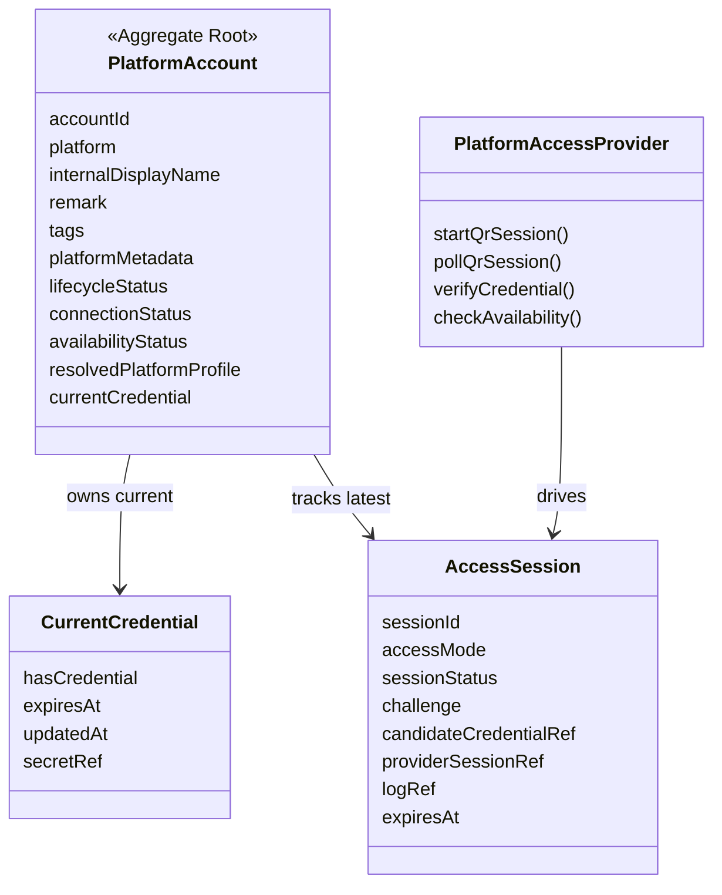

# Cybernomads 账号池领域设计文档

## 1. 领域定位

账号池领域负责管理系统内部的账号包装对象，以及围绕这些账号进行的令牌接入流程。
它的职责重点不是“证明这个平台自然人账号在系统里全局唯一”，而是“让系统能够先建档、再接入、再验证、再稳定使用”。

当前版本的账号池领域包含以下内容：

- 账号包装对象 `PlatformAccount`
- 当前生效凭证 `CurrentCredential`
- 账号绑定的短生命周期接入会话 `AccessSession`
- 平台接入抽象 `PlatformAccessProvider`
- 最近一次成功验证得到的平台资料快照

当前版本不负责以下内容：

- Agent、Workspace、Strategy 等其他领域的角色绑定与编排
- 平台脚本细节、Cookie 加密细节、secret 落盘格式
- 自动刷新令牌
- 凭证历史版本链
- 业务“是否可投放/是否可执行”的最终判定

## 2. 核心共识与统一语言

- 账号池中的“账号”是系统内部的包装对象，不是平台自然人账号的唯一投影。
- 同一个平台 UID 可以出现在多个包装账号上，这在领域上是允许的。
- 账号可以先创建，再通过扫码或手工令牌去接入。
- 当前账号只保留一套“当前生效凭证”。
- 所有新的接入动作都通过 `AccessSession` 进入，验证成功后才会替换当前凭证。
- 对前端和产品统一使用“令牌”话术；对内允许结构化凭证 payload。

### 2.1 词汇表

- `PlatformAccount`：系统内部管理的账号包装对象。
- `accountId`：账号包装对象的稳定唯一标识。
- `platform`：账号所属平台，例如 `bilibili`。
- `internalDisplayName`：系统内部显示名称，用于人类识别。
- `platformMetadata`：平台扩展字段，承载平台私有补充信息。
- `CurrentCredential`：当前已经验证成功、正在生效的凭证。
- `AccessSession`：账号绑定的一次短生命周期接入会话。
- `manual_token`：手工录入令牌的接入方式。
- `qr_login`：通过二维码登录拿到令牌的接入方式。
- `resolvedPlatformProfile`：最近一次成功验证后回填的平台资料快照。
- `PlatformAccessProvider`：统一的平台接入提供者抽象。

## 3. 领域模型

### 3.1 聚合边界

- `PlatformAccount` 是聚合根。
- `CurrentCredential` 不是独立聚合，只从属于账号。
- `AccessSession` 是账号绑定的流程资源，作为独立读写对象存在，但语义上从属于账号。
- `resolvedPlatformProfile` 只表达最近一次验证得到的平台观察结果，不参与账号唯一性建模。

## 4. 核心状态模型

### 4.1 生命周期状态

- `active`：正常可管理
- `disabled`：停用但仍可读取
- `deleted`：逻辑删除，保留恢复可能

### 4.2 连接状态

- `not_logged_in`：尚未有生效令牌
- `connecting`：存在进行中的接入会话
- `connected`：已有生效令牌
- `connect_failed`：最近一次接入验证失败
- `expired`：当前生效令牌已过期

### 4.3 可用性状态

- `unknown`
- `healthy`
- `risk`
- `restricted`
- `offline`

可用性状态只作为诊断信息，不再主导账号接入主流程。

### 4.4 AccessSession 状态

- `waiting_for_scan`
- `waiting_for_confirmation`
- `ready_for_verification`
- `verifying`
- `verified`
- `verify_failed`
- `expired`
- `canceled`

## 5. 核心业务约束

- 账号创建时不要求平台 UID、平台昵称或头像已经存在。
- 同一个平台 UID 可绑定到多个包装账号。
- 一个账号任一时刻只允许存在一个未终态的 `AccessSession`。
- 创建新的 `AccessSession` 时，旧的未终态 session 必须被取消。
- 当前生效凭证与候选凭证必须分离。
- 验证成功前，不得覆盖当前生效凭证。
- 验证失败时，旧凭证保持不变。
- 普通账号详情不返回原始令牌内容。
- 日志属于 `AccessSession`，不并入账号主体字段。
- 二维码会话默认 60 秒过期；过期后账号状态应从 `connecting` 回落。
- 若账号没有当前生效凭证且会话过期，则回落为 `not_logged_in`。
- 若账号仍保留当前生效凭证且新会话结束，则账号保持 `connected`。
- 逻辑删除后账号仍可查询，也可恢复。

## 6. 核心行为流

### 6.1 最小建档

1. 用户创建账号，只填写平台、内部名称、备注、标签、平台扩展字段。
2. 系统生成 `accountId`，状态为 `not_logged_in`。
3. 用户后续进入详情页完成令牌接入。

### 6.2 手工令牌接入

1. 用户在详情页录入令牌。
2. 系统创建 `manual_token` 类型的 `AccessSession`。
3. 系统保存候选凭证引用，但不替换当前凭证。
4. 调用 `PlatformAccessProvider.verifyCredential()` 校验令牌。
5. 校验成功则替换当前凭证，并回填平台资料。
6. 校验失败则保留旧凭证，记录失败结果与日志。

### 6.3 扫码接入

1. 用户点击刷新二维码。
2. 系统创建 `qr_login` 类型的 `AccessSession`。
3. `PlatformAccessProvider.startQrSession()` 返回二维码 challenge 和 provider session。
4. 前端轮询 `pollQrSession()`。
5. provider 返回“待扫码 / 待确认 / 可验证 / 过期”等状态。
6. 当状态变为 `ready_for_verification` 后，系统自动或手动触发验证。
7. 成功后当前令牌生效，失败则保留旧令牌。

### 6.4 二维码超时回落

1. 二维码会话开始后，如果在 60 秒内未完成扫码或确认，则 session 过期。
2. 过期 session 状态改为 `expired`。
3. 如果账号没有当前令牌，则账号回落为 `not_logged_in`。
4. 前端停止轮询，并提示用户刷新二维码重新开始。

## 7. 平台接入抽象

`PlatformAccessProvider` 是账号池领域访问真实平台能力的统一抽象。

当前约定的动作包括：

- `startQrSession`
- `pollQrSession`
- `verifyCredential`
- `checkAvailability`

其中：

- `startQrSession` 负责生成二维码挑战
- `pollQrSession` 负责轮询扫码结果
- `verifyCredential` 负责用候选令牌拉取平台资料并决定是否生效
- `checkAvailability` 是诊断扩展，不是主流程动作

### 7.1 Bilibili 第一版落地

当前第一版接入 Bilibili，底层依赖 `runtime-assets/skills/bilibili-web-api`：

- `auth qr-start`
- `auth qr-poll`
- `account self-get`

Provider 负责把脚本输出标准化成账号域可消费的结果，不让上层感知脚本字段细节。

## 8. 对外读模型

### 8.1 AccountSummary

用于列表页：

- 账号基础信息
- 生命周期状态
- 连接状态
- 可用性状态
- 最近解析的平台资料摘要
- 是否存在当前凭证

### 8.2 AccountDetail

用于详情页：

- 账号基础资料
- 状态信息
- 当前凭证摘要
- 当前或最近一次 access session 摘要
- 最近连接/验证时间

### 8.3 AccessSessionDetail

用于详情页接入工作台：

- sessionId
- accessMode
- sessionStatus
- challenge
- 是否存在候选凭证
- 是否已应用
- 最近解析出的平台资料
- 过期时间、验证时间、创建更新时间

### 8.4 AccessSessionLogs

用于日志面板：

- 时间戳
- 级别
- 消息
- 结构化 details

## 9. 前端工作台布局约束

详情页按固定工作台心智组织：

- 左侧：基础资料编辑
- 中间：扫码授权 + 令牌输入 + 验证动作
- 右侧上方：连接状态
- 右侧下方：日志面板

新增页只负责最小建档，不承载扫码和令牌验证动作。

## 10. 演进边界

本版完成后，账号池领域的主心智已经收敛为：

- 账号是包装对象
- 凭证只保留当前生效态
- 接入过程统一走 `AccessSession`
- 平台能力统一走 `PlatformAccessProvider`

后续若要演进，可以继续扩展：

- 自动刷新令牌
- 多平台真实 provider
- 更细粒度的诊断能力
- 凭证轮换审计链

但这些都不影响当前 V2 版本的核心边界。
